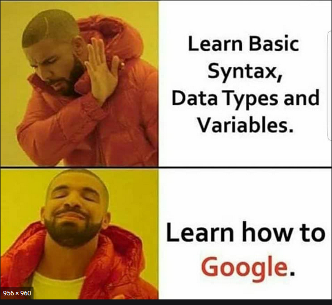

<style type="text/css">
body, td {
   font-size: 14px;
}
code.r{
  font-size: 25px;
}
pre {
  font-size: 25px
}

slides > slide:not(.nobackground):after {
  content: ""
}
</style>


```{r setup, include=FALSE}
knitr::opts_chunk$set(echo = TRUE , fig.align = 'center')
```

## 1 – Naming conventions

- R has no standardised naming conventions
- Always choose a naming convention to work with; for example
  - all lowercase: e.g. adjustcolor
  - underscore separated: e.g. numeric_version
  - lowerCamelCase: e.g. addTaskCallback
  - UpperCamelCase: e.g. SignatureMethod
- **Avoid SPACES** while naming files 

***

“There are only two hard things in Computer Science: cache invalidation and naming things.” — Phil Karlton
  
***

- Strive for names that are concise and meaningful
- R file names should be meaningful and end in .R.

## Object names

- Variable and function names should be lowercase. 

```{r , eval=FALSE}
# Good
day_one
day_1

# Bad
first_day_of_the_month
DayOne
dayone
djm1
```

- avoid using names of existing functions and variables.

## 2 – Files organisation

- File organisation makes code and data analysis project readable
- Data should be seperated from codes
- Documents should be seperated from codes
- Use project facility of RStudio each time you start working on a new project

## 3 -  organise the code within each file

- Start each file with a comment saying who wrote it and when, what it contains, and how it fits into the larger program

- Load all required packages

- Source required data files if any

****

```{r, eval=FALSE}
#----------------------------------------------
## I-Star Introduction
## Ken Mwai - May 2021
#----------------------------------------------
#----------------------------------------------
# 0 - Load librairies
#----------------------------------------------
library(dplyr)
library(ggplot2)
#----------------------------------------------
# 1 - Source Data
#----------------------------------------------
df1 <- read_csv("data/my_data.csv")
#----------------------------------------------
# 2 - Start my code
#----------------------------------------------
mean(mtcars$mpg)
```


## 3 – Syntax

- Place spaces around all infix operators `(=, +, -, <-, etc.)`.
- Use `<-`, not `=`, for object assignment in R.
- Use comments to mark off sections of code.
- Comment your code with care. Comments should explain the why, not the what
- Each line of a comment should begin with the comment symbol and a single space
- Keep your lines less than 80 characters.


*** 

```{r, eval=FALSE}
# This is a comment
# Good
# Object assignment in R
x <- 10 

#Bad
x=10 
```

***

```{r , eval=FALSE}
# Good
average <- mean(feet / 12 + inches, na.rm = TRUE)

# Bad
average<-mean(feet/12+inches,na.rm=TRUE)
```


## Use <-, not =, for assignment. 

```{r, eval=FALSE}
# Good
x <- 5
# Bad
x = 5
```


***

#### Task
::: {.task}
Take a first look at the data. Useful functions are
`dim()`, `head()`, `str()` and `summary()`.
:::

***

#### Solution
```{r load-mice-solution}
## shows the dimension of the data
dim(mtcars)
```


***

```{r}
## shows the first few observations of the data
head(mtcars)

```


***

```{r}
## checks the data structure
str(mtcars)

```


***

```{r}
summary(mtcars)
```


***



***

```{r , eval=FALSE}
 c<-d(TRUE,TRUE,TRUE,FALSE,TRUE,FALSE)
Error in d(TRUE, TRUE, TRUE, FALSE, TRUE, FALSE) :
could not find function "d"
```

