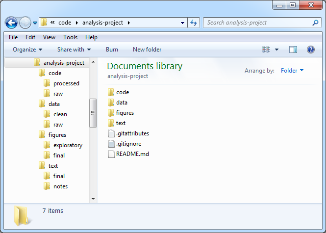

```{r , include=FALSE}
hint <- function(text) {
  id <- paste0('hint_', sample.int(1e10, size = 1))
    cat(
    paste0('\n',
      '<button type="button" class="btn btn-info btn-sm" data-toggle="collapse" ',
      'data-target="#', id, '">Hint</button>',
      '<div id = "', id, '" class="collapse" style="border:1px; ',
      'border-style:solid; padding: 1em; border-color:#1F78B4">',
      text, '</div>')
  )
}

```

## Overview and History of R

  - R is a dialect of the S language.
  - S is a language that was developed by John Chambers and others at Bell Labs. S was initiated in 1976
  - R was created in 1991 – by Rose Ihaka and Robert Gentleman
  - In 1993 R was released to the public. 1997: R core group was formed 2000: R 1.0.0 was released
  - We are using R version 4.* (202*) 


## Features of R
 - Runs on almost any standard computing platform/OS (even on the PlayStation 3)
 - Frequent releases (annual + bug_x releases); active development.
 - Useful for interactive work, but contains a powerful programming language for developing new tools (user --> programmer)


## Feature of R
 - Very active and vibrant user community; 
    - R-help
    - R-devel mailing lists 
    - Stack Overflow – look at them on when at R help
 - It's free! (Both in the sense of beer and in the sense of speech.)

***


  
## Setup local environment
 - Download  R from - The Comprehensive R Archive Network -http://cran.r-project.org/ and R Studio 
  - Available for the key OS \newline
  
 **R-studio?**
 -RStudio is the premier integrated development environment for R. - Download and install from http://www.rstudio.com/

**Why R-studio?**
 - RStudio's source editor includes a variety of productivity enhancing features including syntax highlighting, code completion, multiple-file editing, and find/replace, retrieving prev commands

## Sometimes it is tricky ...

 - R can be tricky to learn,
 - feel free to contact/tweet/IG/DM  any of the demonstrators with questions
 - *please make sure that you have thought through your question in advance*
 - *R problems can be solved with judicious use of Google and StackOverFlow*
 
## Help Areas

  - R Help Mailing List - https://stat.ethz.ch/mailman/listinfo/r-help
  - R CookBook - http://www.cookbook-r.com/
  - R-Bloggers - http://www.r-bloggers.com/
  - Stack overflow About R - http://stackoverflow.com/tags/r/info
  - Stack overflow R FAQ - http://stackoverflow.com/tags/r
  - R google group - https://groups.google.com/forum/#!forum/r-help-archive
  - https://exeter-data-analytics.github.io/IntroToR/

## Types of people in the world

 - *There are **10 types of people** in this world, those who understand binary and those who dont*

## The Terms

  - **Object** R is an object oriented language and everything in R is an object. 
      - We store using `<-` operator ie  `x <- 3`
  - **Function** A set of instructions carried out on one or more objects.
    - function *mean()* is used to calculate the arithmetic mean.
  - **Vector** A collection of one or more objects of the same type . We use `c()` 
  - **Operator** Is a symbol that has a pre-defined meaning. +\*-/
  - **Parameter** The kind of information that can be passed to a function – mean(age)

## Packages

  - A set of functions designed to perform more specific statistical or graphical tasks examples and documentation.
  - 17000+ packages found on the CRAN
  - To use packages in R, download using `install.packages()`

## Data Types / Classes

  
Data Types          | Stores                    | 
--------------------|---------------------------|
real                | floating point numbers    | 
integer             | integers                  |
complex             | Complex numbers           |
factor              | categorical data          | 
character           | strings                   | 
logical             | TRUE or FALSe             | 
NA                  | Missing                   |
NULL                | Empty                     |
Function            | Function type             | 


## RStudio Platform {.flexbox .vcenter}


## Vector

- A vector can only contain objects of the same class

```{r }
# numeric vector
a <- c(1,2,5.3,6,-2,4) 
# character vector
b <- c("one","two","three")
#logical vector
c <- c(TRUE,TRUE,TRUE,FALSE,TRUE,FALSE) 
```


## Factors
 - Used to represent categorical data. 
 - Can be unordered or ordered.
    -A factor is like an integer vector where each integer has a label.
```{r }
# A factor variable
  x <- factor(c("yes", "yes", "no", "yes", "no"))
  x
```


## Missing Values
 - Missing values are represented by the symbol **NA** (not available)
 - Impossible values (e.g., dividing by zero) are represented by the symbol NaN (not a number)

 - Can be unordered or ordered.
    -A factor is like an integer vector where each integer has a label.


## Data Frames

 - More general than a matrix, has different columns and can have different modes (numeric, character, factor, etc.)
 - Used to store tabular data
 - Can store data of different classes
 - *read_._table()* or *read_._csv()* – used to load `data.frames`
 
## Create Data Frames

```{r }
## create a data frame
## create vector x
x <- c(1, 2,3,4,5,6,7,8,9)
# create vector y
y <- c("a","b","c","d","e","f","g","h","i")
# combine them to a data frame df
df <- data.frame(x=x, y=y)
```


* * *

```{r }
# view the contents of a data frame
print(df)
# check the structure of the data frame
str(df)
```


## Datasets

- R works with different types of datasets 
- Base R functions *read.table* and *read_._csv* can read in data stored as text files, delimited by *almost anything* 
- Data from other statistics tools can be read using 
   - `readxl` - for excel datasets
   - `haven` - for Stata files
   - `foreign` - for other files like SPSS

***
  
#### Task

:::{.task}
Install the `readxl`, `haven` and `foreign` package
:::

***

#### Solution

```{r, eval=FALSE}
install.packages('readxl')
install.packages('haven')
install.packages('foreign')
```


## Creating an analysis project - Ideal Way

 - Using R Studio to create a Project  - From an existing directory 
 


 

