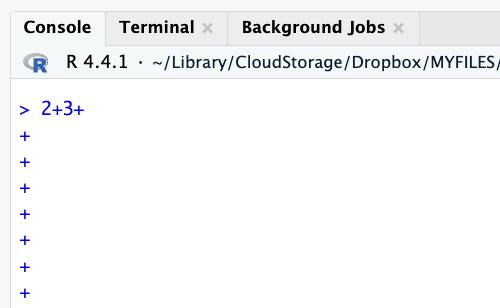

## In this session, we will cover:

- R syntax
- R functions
- Data types
- Data structures

## Explaining R code input and outputs on slides

In slides, a command (also called a code) will look like this

```{r code}
sum(2,3)
```

And then directly after it, will be the output of the code.  
So `sum(2,3)` is the code and '[1] 5 ' is the output.


## R as a calculator

```{r calcDemo}
2 + 2
2 * 4
2^3
```

Note: when you enter your command in the Console, R inherently thinks you want to print the result. 

## R as a calculator

- The R console is a full calculator
- Try to play around with it:
    - +, -, /, * are add, subtract, divide and multiply
    - ^ or ** is power
    - parentheses -- ( and ) -- work with order of operations 
    - %% finds the remainder

## R as a calculator

```{r calcDemo2}
2 + (2 * 3)^2
(1 + 3) / 2 + 45
6 / 2 * (1 + 2)
```

## R as a calculator

Try evaluating the following:

- `2 + 2 * 3 / 4 -3`
- `2 * 3 / 4 * 2`
- `2^4 - 1`


## Assigning values to objects

You can create objects from within the R environment and from files on your computer.

R uses `<-` to assign values to an object name (you might also see `=` used, but this is not best practice).

`<-` assigns **values on the right** to **variables on the left**.

```{r}
x <- 2
x
x * 4
```


## R Data types
**Data type: Defines the nature of a single value. Some data types are:**

- `"numeric"`: for any numerical value
- `"character"`: for text values., denoted using quotes `("")`
- `"integer"`: for whole numbers 
- `"logical"`: that we won't discuss further
- `"complex"`: that we won't discuss further


## R Data types (examples)
**Use the `class()` function to check the class of an object.**

**Numeric**

```{r}
x <- 2
class(x)
```


**Character**

```{r assignClass}
y <- "hello world!"
class(y)
```


## R Data structures
**Data Structure** 

Defines how multiple values are organized and stored. Some are: 

- Vector
- Matrix
- Data Frame 
- List
- ...there are more

## Vectors
- Most common and basic data structure in R
- They are one dimensional
- Can have multiple sets of observations, but must be of the same `class`.

    **vector of numbers**
    ```{r, fig.alt="Vector of numbers", out.width = "30%", echo = FALSE, fig.align='left'}
    knitr::include_graphics("https://hbctraining.github.io/Training-modules/IntroR/img/vector2.png")
    ```

    **vector of characters**
    ```{r, fig.alt="Vector of numbers", out.width = "30%", echo = FALSE, fig.align='left'}
    knitr::include_graphics("https://hbctraining.github.io/Training-modules/IntroR/img/vector1.png")
    ```

- Each value of a vector is referred to as an `element`.

## Matrix
- A collection of vectors of the **same length and identical datatype.**
- Vectors can be combined as columns in the matrix or by row, to create a 2-dimensional structure.

    ```{r, fig.alt="Matrix of numbers", out.width = "40%", echo = FALSE, fig.align='center'}
    knitr::include_graphics("https://hbctraining.github.io/Training-modules/IntroR/img/matrix.png")
    ```

## Data Frame
- The _de facto_ data structure for most tabular data is the `data.frame`.
- It's like an Excel file with rows (observations) and columns (variables).
- Unlike a `Matrix`, in a `data.frame` each vector (column) can be of a different data type (e.g., characters, integers, factors)

    ```{r, fig.alt="Matrix of numbers", out.width = "40%", echo = FALSE, fig.align='center'}
    knitr::include_graphics("https://hbctraining.github.io/Training-modules/IntroR/img/dataframe.png")
    ```

# Common Issues

## TROUBLESHOOTING: R is case sensitive

Object names are case-sensitive, i.e., `X` and `x` are different

```{r}
x
```

```{r error = TRUE}
X
```

## TROUBLESHOOTING: No commas in big numbers

Commas separate objects in R, so they shouldn't be used when entering big numbers.

```{r error = TRUE}
z <- 3,000
```

## TROUBLESHOOTING: Complete the commads

```{r error = TRUE}
2+2+
```

`+` indicates an incomplete statement. Hit "esc" to clear and bring back the `>`.

```{r, fig.alt="Incomplete statements make a + sign appear in the Console.", out.width = "45%", echo = FALSE, out.extra='style="float:left"'}

```

## Simple object practice

Try assigning your full name to an R object called `name`

## Simple object practice

Try assigning your full name to an R object called `name`

```{r myName}
name <- "Rex Masai"
name
```

## The 'combine' function `c()`

The function `c()` collects/combines/joins single R objects into a vector of R objects. It is mostly used for creating vectors of numbers, character strings, and other data types. 

```{r assign3a}
x <- c(1, 4, 6, 8)
x
class(x)
```

## The 'combine' function `c()`

Try assigning your first and last name as 2 separate character strings into a single vector called `name2`

## The 'combine' function `c()`

Try assigning your first and last name as 2 separate character strings into a length-2 vector called `name2`

```{r myName2}
name2 <- c("Rex", "Masai")
name2
```

## Arguments inside R functions

- The contents you give to an R function are called "arguments"
- Here, R assumes all arguments should be objects contained in the vector
- We will talk more about arguments as we use more complicated functions!

```{r eval = FALSE}
name2 <- c("Rex", "Masai")
# Arg 1    ^^^^^
```

```{r eval = FALSE}
name2 <- c("Rex", "Masai")
# Arg 2           ^^^^^^^^^
```

## `length` of R objects

`length()`: Get or set the length of vectors, and of any other R object for which a structure has been defined.

```{r assign3b}
length(x)
y
length(y)
```

## `length` of R objects

What do you expect for the length of the `name` object? What about the `name2` object?

What are the lengths of each?

##  `length` of R objects

What do you expect for the length of the `name` object? What about the `name2` object?

What are the lengths of each?

```{r myName3}
length(name)
length(name2)
```


## Math + vector objects

You can perform functions to entire vectors of numbers very easily.

```{r}
x + 2
x * 3
x + c(1, 2, 3, 4)
```

## Math + vector objects

But things like algebra can only be performed on numbers.

```{r, error=TRUE}
name2 + 4
```

## Reassigning to a new object

Save these modified vectors as a new vector called `y`.

```{r assign5}
y <- x + c(1, 2, 3, 4)
y
```

Note that the R object `y` is no longer "hello  world!" - It has been overwritten by assigning new data to the same name.

## Reassigning to a new object

Reassigning allows you to make changes "in place"

```{r eval = FALSE}
# results not stored:
x + c(1, 2, 3, 4)

# x remains unchanged, results stored in `y`:
y <- x + c(1, 2, 3, 4)

# replace `x` in place
x <- x + c(1, 2, 3, 4)
```

## R objects

You can get more attributes than just class. The function `str()` gives you the structure of the object.

```{r assign2}
str(x)
str(y)
```

This tells you that `x` is a numeric vector and tells you the length.


## Useful functions to create vectors `seq()`

For numeric: `seq()` can be very useful.   
The `from` argument says what number to start on.    
The `to` argument says what number to not go above.   
The `by` argument says how much to increment by.    

```{r}
seq(from = 0, to = 1, by = 0.2)
seq(from = 0, to = 10, by = 1)
```

## Useful functions to create vectors `rep()`

For character: `rep()` can create very long vectors. 
Works for creating character and numeric vectors.

The `each` argument specifies how many of each item you want repeated.
The `times` argument specifies how many times you want the vector repeated.

`rep(WHAT_TO_REPEAT, arguments)`

```{r}
rep(c("black", "white"), each = 3)
```

## Useful functions to create vectors `rep()`

For character: `rep()` can create very long vectors. 
Works for creating character and numeric vectors.

The `each` argument specifies how many of each item you want repeated.
The `times` argument specifies how many times you want the vector repeated.

`rep(WHAT_TO_REPEAT, arguments)`

```{r}
rep(c("black", "white"), times = 3)
```


## Useful functions to create vectors `rep()`

For character: `rep()` can create very long vectors. 
Works for creating character and numeric vectors.

The `each` argument specifies how many of each item you want repeated.
The `times` argument specifies how many times you want the vector repeated.

`rep(WHAT_TO_REPEAT, arguments)`

```{r}
rep(c("black", "white"), each = 2, times = 2)
```


## Getting help in R

**`help()` and `?`**

The `help()` function and `?` help operator in R provide access to the documentation pages for R functions, data sets, and other objects, both for packages in the standard R distribution and for contributed packages. 

```{r, fig.alt="Help in R", out.width = "65%", echo = FALSE, fig.align='center'}

```


## Summary

- R functions as a calculator
- Use `<-` to save (assign) values to objects
- Use `c()` to **combine** vectors
- `length()`, `class()`, and `str()` tell you information about an object
- The sequence `seq()` function helps you create numeric vectors (`from`,`to`, `by`, and `length.out` arguments)
- The repeat `rep()` function helps you create vectors with the `each` and `times` arguments

