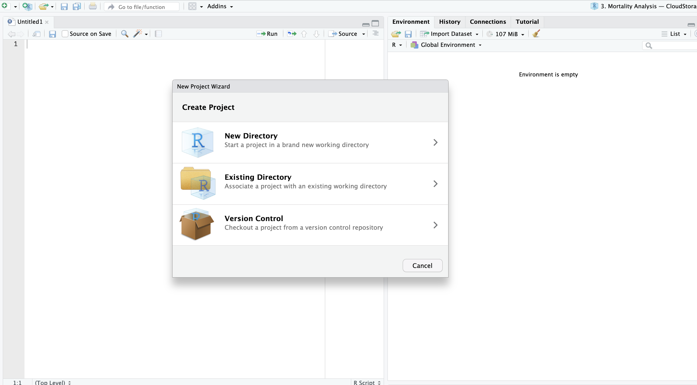
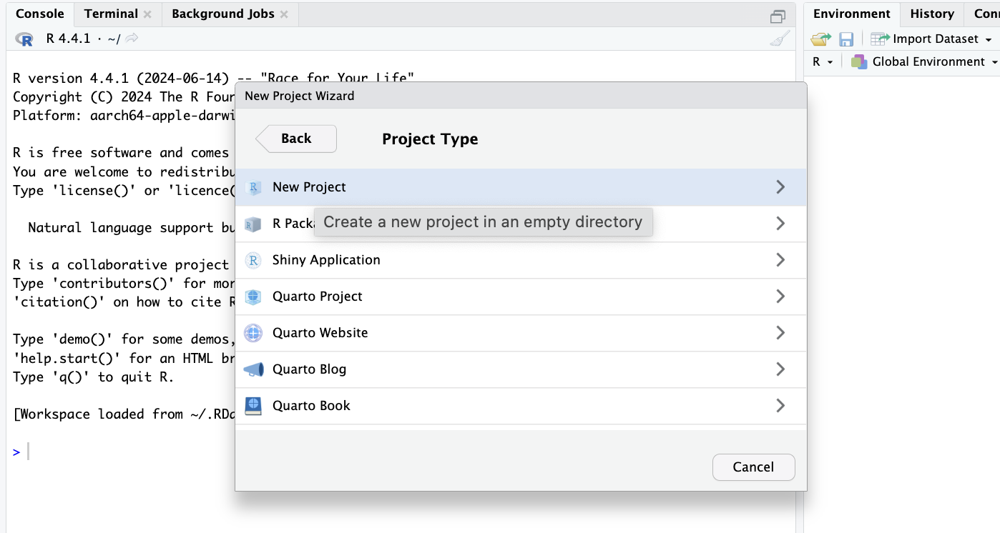
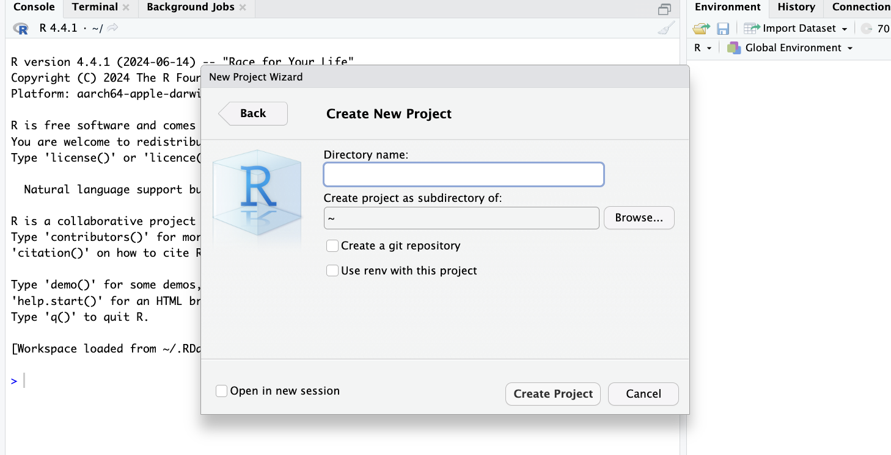
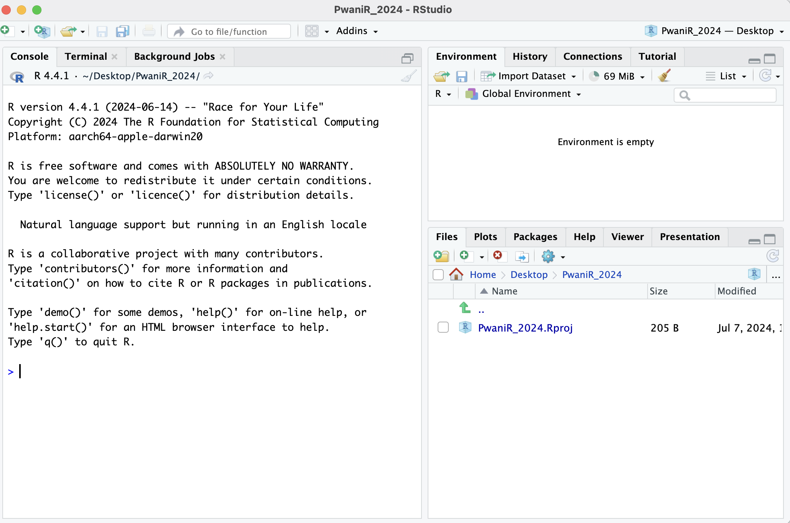
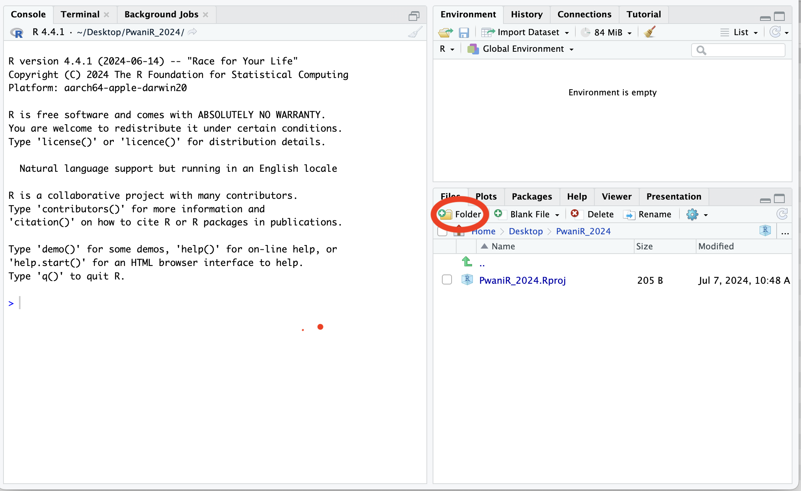
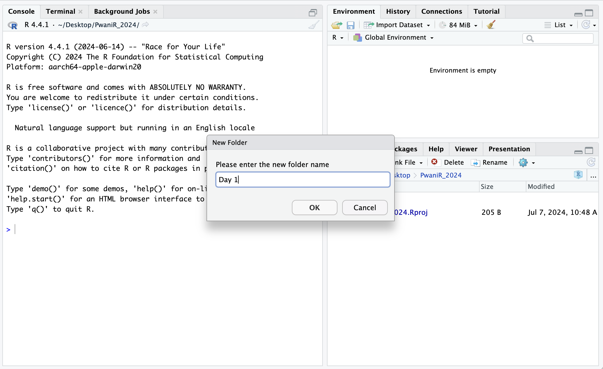
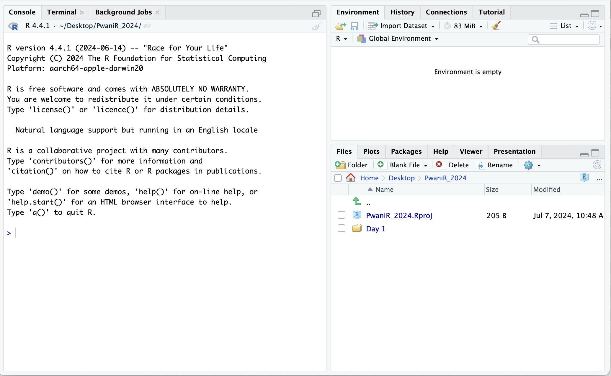
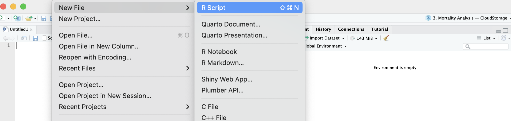

  
## In this session, we will cover:
  
- Creating a new project directory in RStudio
- Starting and saving a new R script
- Good coding practice

## Creating a new project directory in RStudio

- Open R Studio; go to the `File` menu and select `New Project`.
- In the `New Project` wizard, choose `New Directory`. 

```{r, fig.alt="New Project", out.width = "65%", echo = FALSE, fig.align='center'}

```

## Creating a new project directory in RStudio

```{r, fig.alt="New Project", out.width = "65%", echo = FALSE, fig.align='center'}

```

- Then select `New Project`
- Name your new directory `PwaniR_2024` 

## Creating a new project directory in RStudio

```{r, fig.alt="New Project", out.width = "65%", echo = FALSE, fig.align='center'}

```

- Click on `Browse` to select the location of the project
- Finally click on `Create Project`

## Creating a new project directory in RStudio

**The RStudio interface should now look like the screenshot below.**

```{r, fig.alt="New Project", out.width = "65%", echo = FALSE, fig.align='center'}

```


## Creating folders and sub-folders

**Creating a new project directory in RStudio**
- Click on `New Folder` in the bottom right pane


```{r, fig.alt="New Project", out.width = "65%", echo = FALSE, fig.align='center'}

```

## Creating folders and sub-folders

- Name the folder `Day 1` and click OK

```{r, fig.alt="New Project", out.width = "65%", echo = FALSE, fig.align='center'}

```


## Creating folders and sub-folders

**The RStudio interface should now look like the screenshot below.**


- The `Files` shows the new folder named `Day 1`

```{r, fig.alt="New Project", out.width = "65%", echo = FALSE, fig.align='center'}

```


## Structuring your project directory
**Guiding principles**

- Have separate folders for data and R scripts. For instance:
  - Have a `data` sub-folder within `Day 1` for storing data
  - Have a `scripts` sub-folder within `Day 1` for storing R scripts
  - Have a `graphs` sub-folder within `Day 1` for storing plotted graphs
  - Have a `resources` sub-folder within `Day 1` for storing shared files
  - Have a `excercises` sub-folder within `Day 1` for storing excercises


# R scripts

## Starting a new R Script

*After creating a new project:*

- Go to the `File` menu and select `New File`, and select `R Script`.
- Go to the `File` menu and select `Save As`
- Type `Intro-to-R.R` and select `Save` in the `scripts` folder

```{r, fig.alt="New Project", out.width = "90%", echo = FALSE, fig.align='center'}

```


## Good coding practices
**Best practice is to enter the commands in the script editor and save the script.**


`#` creates a comment in R code

```{r}
# this is a comment

# nothing to its right is evaluated

# this # is still a comment
### you can use many #'s as you want

1 + 2 # Can be the right of code
```


# Hands-on practice

## Excercise 1
In the shared files, open document named `excercise_01`


