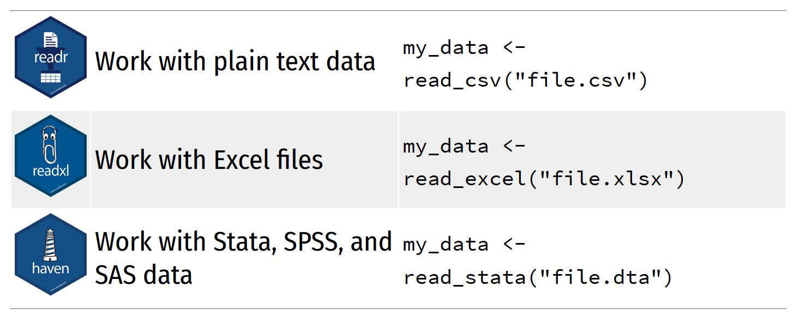
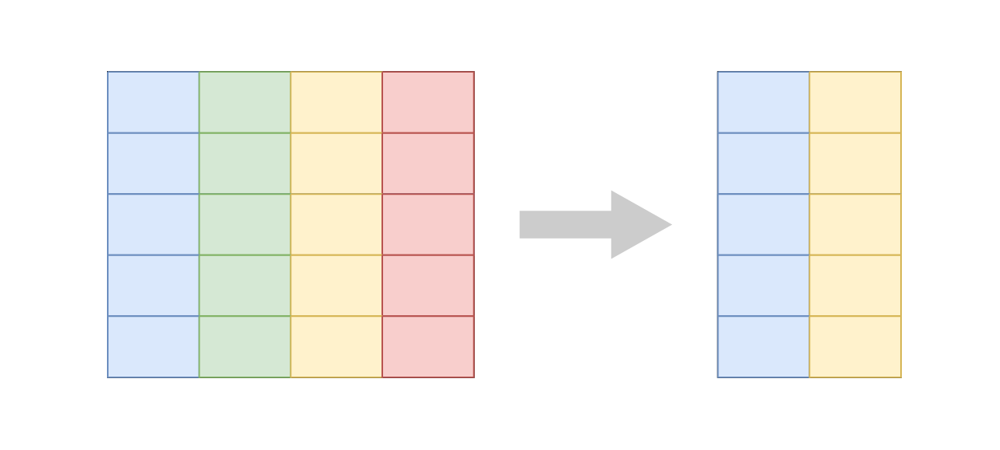
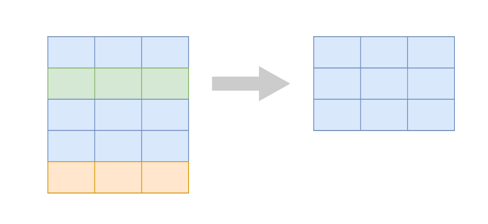
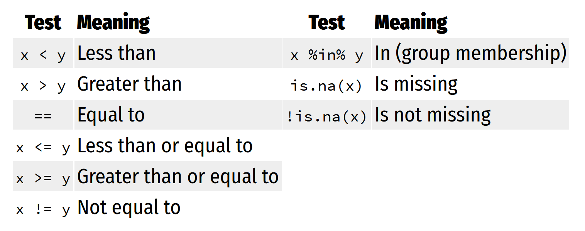
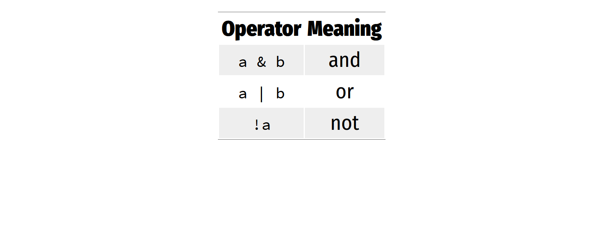
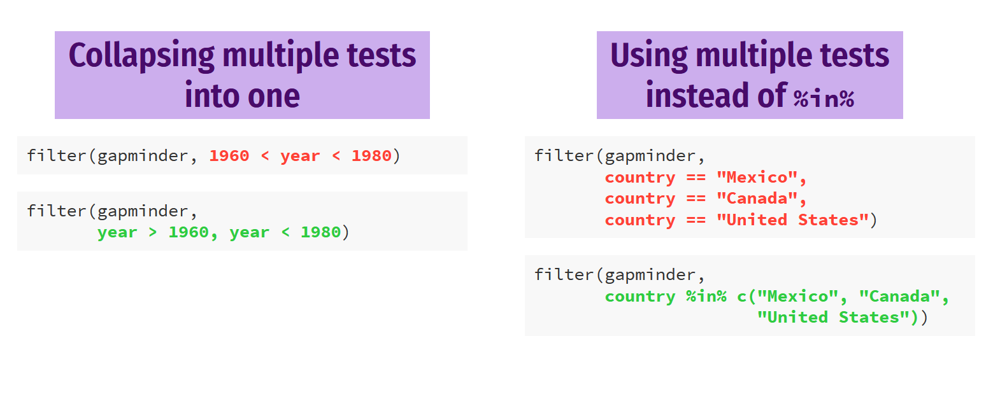
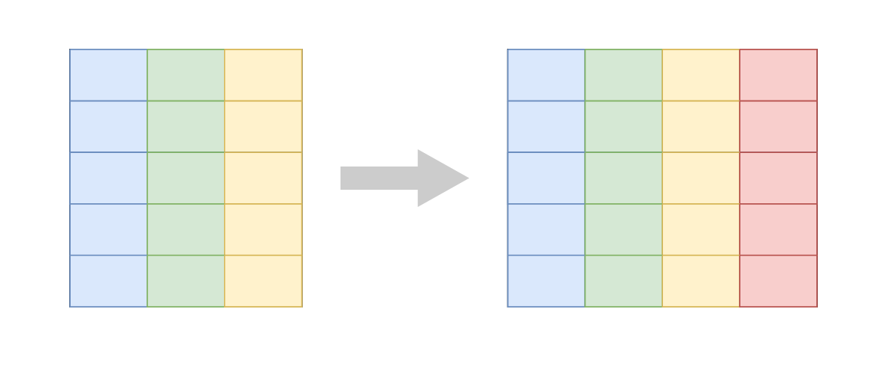
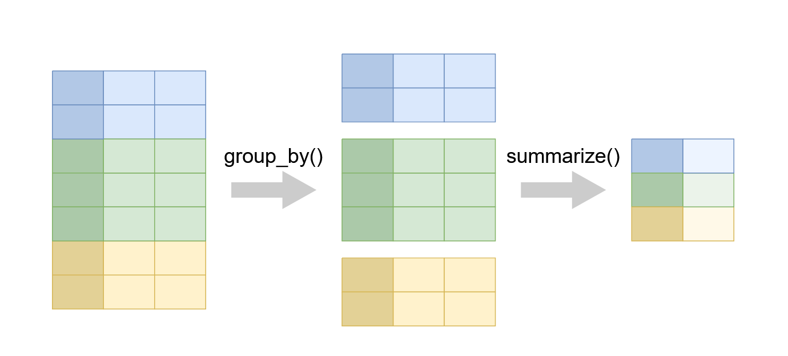
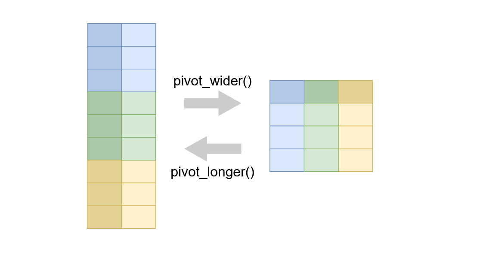

```{r, include=FALSE}
library(kableExtra)
library(tidyverse)
options(knitr.table.format = "latex")
knitr::opts_chunk$set(fig.align="center")
```

## The tidyverse help

- https://ggplot2.tidyverse.org/

- https://www.tidyverse.org/learn/

## Using packages in R

```{r , eval=FALSE ,  class.source="highlight_code"}
install.packages('name')
```

- `r text_spec("Downloads the files to your computer", font_size = 20)`
- `r text_spec("Do this once per computer", background = "#D05A6E", color = "white", bold = T)`

<hr/>

```{r,  eval=FALSE , class.source='highlight_code'}
# How to use the package
library('name')
```

- `r text_spec("Loads the package", font_size = 20)`
- `r text_spec("Do this once per seesion", background = "#D05A6E", color = "white", bold = T)`

The tidyverse  
===

coherent system of packages for data manipulation


## The tidyverse {.columns-2 .smaller}

### Tidyverse?
- The tidyverse is an opinionated collection of R packages designed for data science.

- All packages share an underlying design philosophy, grammar, and data structures.

- The tidyverse makes data science faster, easier and more fun

<p class="forceBreak"></p>

<div class="image_float">


</div>

***

#### Task

- The tidyverse package is a shortcut for installing and loading all the key tidyverse packages

:::{.task}
Install the `tidyverse` package
:::


***

#### Solution

```{r, eval=FALSE}
install.packages('tidyverse')
```


```{r, eval=FALSE}
install.packages("ggplot2")
install.packages("dplyr")
install.packages("tidyr")
install.packages("readr")
install.packages("purrr")
install.packages("tibble")
install.packages("stringr")
install.packages("forcats")
install.packages("lubridate")
install.packages("hms")
install.packages("DBI")
install.packages("haven")
install.packages("httr")
install.packages("jsonlite")
install.packages("readxl")
install.packages("rvest")
install.packages("xml2")
install.packages("modelr")
install.packages("broom")
```


## Data frames and tibbles

-	Data frames are the most common kind of data objects; used for rectangular data (like spreadsheets)
-	Data frames: R's native data object
-	Tibbles (tbl): a fancier enhanced kind of data frame

- `r text_spec("(You really won't notice a difference in this class)", background = "#D05A6E", color = "white", bold = T)`


## Vectors
 - Vectors are a list of values of the same time (all text, or all numbers, etc.)
 - `r text_spec("Make them with c():", background = "#D05A6E", color = "white", bold = T)`
 
```{r }
c(1, 4, 2, 5, 7)
```


***
- You'll usually want to assign them to something:
:::{.task}
Create a vector `c(1, 4, 2, 5, 7)` and assign it `neat_numbers` object name
:::


***

#### Solution

```{r}
neat_numbers <- c(1, 4, 2, 5, 7)
```


## Packages for importing data

```{r image_import, echo=FALSE, out.height=  '100%', out.width='70%'}

``` 
<!--  -->


***
- Hint use `read_csv` after loading `tidyverse`

:::{.task}
Read in the `birthweight.csv file` and assign it to `bw_df`
:::


***

#### Solution

```{r, eval=FALSE}
library(tidyverse)
bw_df <- read_csv('data/birthweight.csv')
```


The tidyverse: dplyr
===

```{r, include=FALSE}
library(gapminder)
```


Transform the data with dplyr

## Dataset to use
 - Excerpt of the `Gapminder` data on life expectancy, GDP per capita, and population by country.
 - The data frame `gapminder` has 1704 rows and 6 variables
    - Country -factor with 142 levels
    - Continent -    factor with 5 levels
    - Year - ranges from 1952 to 2007 in increments of 5 years
    - lifeExp - life expectancy at birth, in years
    - Pop - population
    - gdpPercap - GDP per capita (US$, inflation-adjusted)

 - `r text_spec("Task: Install and load the gapminder package", background = "#D05A6E", color = "white", bold = T)`
 
 
***

```{r}
library(gapminder)
glimpse(gapminder)
```


## dplyr: verbs for manipulating data

```{r image_pca, echo=FALSE, out.height=  '100%', out.width='70%'}
knitr::include_graphics('images/dplyr2.PNG')
```


dplyr: select
===

Select a subset of variables


```{}
select(.data = DATA, ...)
```

  - `DATA` = Data frame to transform
  - `...` = variables to select
  
  
***

### Select specific columns

```{r , echo=FALSE, out.height=  '100%', out.width='70%'}

``` 

## Our data

```{r}
head(gapminder)
```  
  
## Subset country and life expectancy and year variables only

```{r, class.source='highlight_code'}
select(.data = gapminder, c(country,year , lifeExp))
```


## Task #1: Select

:::{.task}
Use select() 

  - subset `country`,`year`,`gdpPercap`, and `pop` variables only
  
  - create a new object called `population_gdp` assinged to subset data
  
:::

***

### Select() solution

```{r, class.source='highlight_code'}
population_gdp <- select(gapminder, c(country,year,gdpPercap,pop))
population_gdp 
```


dplyr: filter
===

Pick rows: filter()


## Extract rows that meet some sort of test

```{}
filter(.data = DATA, ...)
```

  - `DATA` = Data frame to transform
  - `...` = One or more tests
  - `filter()` returns each row for which the test is TRUE

***

### Filter specific rows

```{r , echo=FALSE, out.height=  '100%', out.width='70%'}

``` 

  
## Our data

```{r}
head(gapminder)
```

 
## Filtering only Tanzania data 

- NB: We use `==` which tests if equal
  - One `=` sets an argument.

```{r, class.source='highlight_code'}
filter(.data = gapminder, country == "Tanzania")
```


## Logical tests

```{r logical_test, echo=FALSE, out.height=  '100%', out.width='100%'}

```


## Task #1: Filtering

:::{.task}
Use filter() and logical tests to show…  

  - The data for  Kenya
  
  - All data for countries in Oceania `r text_spec("Hint: Oceania is not a country", background = "#D05A6E", color = "white", bold = T)`
  
  - Rows where the life expectancy is less than 30
:::


***

### filter the data for Kenya

```{r, class.source='highlight_code'}
filter(gapminder, country == "Kenya")
```


***

### filter all data for countries in Oceania

```{r, class.source='highlight_code'}
filter(gapminder, continent == "Oceania")
```


***

### filter rows where the life expectancy is less than 30

```{r, class.source='highlight_code'}
filter(gapminder, lifeExp <30)
```


## Common mistakes

- `r text_spec("Using = instead of == ", background = "#FF0000", color = "white", bold = T)`
- `r text_spec("Forgeting quote", background = "#FF0000", color = "white", bold = T)`

```{r , eval=FALSE}

## Wrong
filter(gapminder,       country = "Kenya")
filter(gapminder,       country = Kenya)


## Correct
filter(gapminder,       country == "Kenya")
```


## filter() with multiple conditions

-  Extract rows that meet every test
-  Extract for `Tanzania` before year `2000`

```{r, class.source='highlight_code'}
filter(.data = gapminder, country == "Tanzania" , year<2000)
```


## Boolean operators

```{r boolean, echo=FALSE, out.height=  '100%', out.width='100%'}

```


## These do the same thing:

```{r, eval=FALSE, class.source='highlight_code'}
filter(.data = gapminder, country == "Tanzania" , year<2000)
```

<hr/>


```{r, eval=FALSE, class.source='highlight_code'}
filter(.data = gapminder, country == "Tanzania" &  year<2000)
```


## Task #2: Filtering

:::{.task}

- `r text_spec("Use filter() and Boolean logical tests to show…", background = "#D05A6E", color = "white", bold = T)`

  - Kenya after 2000
  
  - Countries  where life expectancy in 2002 is over 80
  
  - Countries where life expectancy in 2007 is below 50 and are not in Africa
:::


***

### filter the data for Kenya after 200

```{r, class.source='highlight_code'}
filter(gapminder, country == "Kenya" & year>2000)
```


***

### filter countries where life expectancy in 2002 is over 80

```{r, class.source='highlight_code'}
filter(gapminder, lifeExp >80 & year==2002)
```


***

###  Countries where life expectancy in 2007 is below 50 and are not in Africa

```{r, class.source='highlight_code'}
filter(gapminder, lifeExp <50 & continent!='Africa' & year==2007)
```

## Common mistakes

```{r mistakes, echo=FALSE, out.height=  '100%', out.width='100%'}

```


dplyr: mutate
===

Create new columns: mutate()

***

```{}
mutate(.data = DATA, ...)
```

  - `DATA` = Data frame to transform
  - `...` = Columns to make

***
### Mutate a new column

```{r , echo=FALSE, out.height=  '100%', out.width='70%'}

``` 

 
## mutate the gdp variable

```{r, class.source='highlight_code'}
mutate(gapminder, gdp = gdpPercap * pop)
```


## mutate 2 variables

```{r, class.source='highlight_code'}
mutate(gapminder, gdp = gdpPercap * pop,
                  pop_mil = round(pop / 1000000))
```


dplyr: ifelse()
===

Do conditional tests within mutate()


***

```{r , eval=FALSE, class.source='highlight_code'}
ifelse(TEST,
       VALUE_IF_TRUE,
       VALUE_IF_FALSE)
```


 - TEST = A logical test
 - VALUE_IF_TRUE = What happens if test is true
 - VALUE_IF_FALSE = What happens if test is false


## Create a variable to show before and after 2000

```{r, eval=FALSE}
mutate(gapminder,
       after_1960 = ifelse(year > 1960, TRUE, FALSE))
```


```{r, class.source='highlight_code'}
mutate(gapminder,
       after_2000 = ifelse(year > 2000,
                           "After 2000",
                           "Before 2000"))
```


## Task #1: Mutate

:::{.task}

- `r text_spec("Use mutate()  and if_else() to…", background = "#D05A6E", color = "white", bold = T)`

  - Add an `africa` column that is TRUE if the country is on the African continent
  
  - Add a column for logged GDP per capita `r text_spec("(hint: use log())", background = "#D05A6E", color = "white", bold = T)`
  
  - Add a column `life_exp_asia` for life expectancy that is TRUE if the country is in Asia and life expectancy id greater than 80
  
  - Add an `africa_asia` column that says “Africa or Asia” if the country is in Africa or Asia, and “Not Africa or Asia” if it’s not
:::


***

### Add an `africa` column

```{r, class.source='highlight_code'}
mutate(gapminder, africa = ifelse(continent == "Africa", 
                                  TRUE, FALSE))

```


***

### Add a column for logged GDP per capita

```{r, class.source='highlight_code'}
mutate(gapminder, log_gdpPercap = log(gdpPercap))
```


***

### Add a column `life_exp_asia` for Asian countries with lifeExp>80

```{r, class.source='highlight_code'}
mutate(gapminder, life_exp_asia=ifelse(continent=="Asia" & lifeExp>80, 
                                       TRUE,FALSE))
```


***

###   Add an `africa_asia` column

```{r, class.source='highlight_code'}
mutate(gapminder, 
       africa_asia = ifelse(continent %in% c("Africa", "Asia"), 
                "Africa or Asia", 
                "Not Africa or Asia"))
```


## What if you have multiple conditions?

- Make a dataset for just 2002 and calculate logged GDP per capita

### Solution 1

```{r, class.source='highlight_code'}
gapminder_2002 <- filter(gapminder, year == 2002)

gapminder_2002_log <- mutate(gapminder_2002,
                             log_gdpPercap = log(gdpPercap))
```


### Solution 2: Pipes

- The %>% operator (pipe) takes an object on the left
- Then passes it as the first argument of the function on the right


```{r , eval=FALSE}
gapminder %>% filter(_, country == "Kenya")
```

***

- These two commands do the same thing

```{r, eval=FALSE, , class.source='highlight_code'}
filter(gapminder, country == "Kenya")

gapminder %>% filter(country == "Kenya")
```


***
- Make a dataset for just 2002 and calculate logged GDP per capita

```{r, eval=FALSE , class.source='highlight_code'}
gapminder_2002_log <- gapminder %>%
  filter(year == 2002) %>%
  mutate(log_gdpPercap = log(gdpPercap))
gapminder_2002_log
```


## %>% : Pipe operator

```{r, eval=FALSE}
leave_house(
  take_breakfast(
    get_dressed(
      wake_up(
        me, ## start here
        time = "8:00"), 
      trouser = TRUE, shirt = TRUE , socks=FALSE), 
    mayai = TRUE, viazi = TRUE , chai=TRUE), 
  nduthi = TRUE, car = FALSE)
```


```{r, eval=FALSE, class.source='highlight_code'}
me %>%
  wake_up(time = "8:00") %>%
  get_dressed(trouser = TRUE, shirt = TRUE , socks=FALSE) %>%
  take_breakfast( mayai = TRUE, viazi = TRUE , chai=TRUE, ukwanju=FALSE) %>%
  leave_house( nduthi = TRUE, car = FALSE)
```

***

Data wrangling with R 1 - Done()
===

Questions()


dplyr: summarize()
===

Compute a table of summaries: summarize()


## Summarize


```{r , echo=FALSE, out.height=  '100%', out.width='70%'}

``` 


tidyr: reshape data
===

pivot_longer() and pivot_wider()


## pivot_wider()

- `pivot_wider()` "widens" data, increasing the number of columns and decreasing the number of rows.
- `pivot_wider()` is an updated approach to `spread()`

```{r , eval=FALSE, class.source='highlight_code'}
DATA %>% 
  pivot_wider(names_from,
       values_from ,
       ....)
```

 - DATA  = A data frame to pivot
 - names_from  = Column(s) to pivot into wider format.
 - values_from = Column(s) to to get the cell values from to be into wider format.
 - `...` = other specifications (check help)
 
****
### Pivot wider and longer

```{r , echo=FALSE, out.height=  '100%', out.width='70%'}

``` 


***

- Filter data after 1992
- Select the `continent, country, year and gdpPercap` and pivot_wider the values of `gdpPercap` by `country`
 

```{r, class.source='highlight_code'}
gapminder_sub <- gapminder %>% 
  select(continent, country, year, gdpPercap) %>% 
  filter(year>1992 )
gapminder_sub %>%
 pivot_wider(names_from =country , values_from =gdpPercap )
```


***
 - What if I remove the continent?


```{r, class.source='highlight_code'}
country_gdp_wider <- gapminder_sub %>%
  select(-continent) %>% 
 pivot_wider(names_from =country , values_from =gdpPercap )
country_gdp_wider
```


## Task #1: pivot_wider

:::{.task}

- `r text_spec("Use pivot_wider() to…", background = "#D05A6E", color = "white", bold = T)`

  - Show the population data only for African countries before 1992. `r text_spec("(hint: pivot_wider() population values from countries)", background = "#D05A6E", color = "white", bold = T)`
  
   - Create a `year_cat` variable  that is `"Before 1980"` if  year in `1952, 1957 ,1962 ,1967, 1972 ,1977`,
   `"1980-2000"` if year in `1982, 1987, 1992, 1997` and `"After 2000"` if year in `2002 and 2007`
   
   - Summarize the median `gdpPerCap` for each `year_cat` by country
   
   - Pivot_wider the median values from the countries
   
:::


***

### Show the population data only for African countries before 1992

```{r, class.source='highlight_code'}
africa_before_1992 <- gapminder %>% 
  filter(continent=="Africa") %>% 
  select(country, year, pop) %>% 
  filter(year<1992 )
africa_before_1992_wide <- africa_before_1992 %>%
 pivot_wider(names_from =country , values_from =pop )
africa_before_1992_wide
```


***

### Add a column `year_cat`

```{r, class.source='highlight_code'}
gapminder <- gapminder %>% 
  mutate(year_cat=ifelse(year %in% c(1952, 1957 ,1962 ,1967, 1972 ,1977), 
                         "Before 1980",
                         ifelse(year %in% c(1982, 1987, 1992, 1997), 
                                "1980-2000","After 200")))
glimpse(gapminder)
table(gapminder$year_cat)
```

*** 

### Summarize the median of each country by `year_cat`

```{r, class.source='highlight_code'}
gapminder_yearcat <- gapminder %>% 
 group_by(year_cat, country) %>% 
  summarise(med_gdpPercap=median(gdpPercap))
head(gapminder_yearcat)

```

*** 

### pivot_wider `year_cat` values over country

```{r, class.source='highlight_code'}
median_gdpPercap <- gapminder_yearcat %>% 
   pivot_wider(names_from =country , values_from =med_gdpPercap )
median_gdpPercap
```


## pivot_longer()

- `pivot_longer()` "lengthens" data, increasing the number of rows and decreasing the number of columns.
- `pivot_longer()` is an updated approach to `gather()`

```{r , eval=FALSE, class.source='highlight_code'}
DATA %>% 
  pivot_longer(cols,
               names_to = ,
               values_to = ,
       ....)
```

 - DATA  = A data frame to pivot
 - cols  = Columns to pivot into longer format.
 - names_to = name of the column to create from the data stored in the column names
 - values_to = string specifying the name of the column to create from the data stored in cell values
 - `...` = other specifications (check help)

***

- We use the `country_gdp` pivot_longer the values of `gdpPercap`

```{r, class.source='highlight_code'}
country_gdp_longer <- country_gdp_wider %>%
 pivot_longer(cols =!year, names_to="country",values_to = "gdpPercap")  
country_gdp_longer
```

 
## Task #1: pivot_longer

:::{.task}

- `r text_spec("Use pivot_longer() to…", background = "#D05A6E", color = "white", bold = T)`

  - pivot_longer the values of `median_gdpPercap` into `country` and `med_gdpPercap`
   
:::


***

### Solution

```{r, class.source='highlight_code'}
median_gdpPercap_longer <- median_gdpPercap %>%
 pivot_longer(cols =!year_cat , names_to="country",values_to = "med_gdpPercap")  
median_gdpPercap_longer
```


****

### How to export  data to CSV

```{r , eval=FALSE, class.source='highlight_code'}
write_csv(x = median_gdpPercap_longer, file = "median_gdpPercap_longer.csv")
```


### How to export  data to Stata

```{r , eval=FALSE, class.source='highlight_code'}
## bad code
library(haven)
haven::write_dta(x = median_gdpPercap_longer, file = "median_gdpPercap_longer.dta")
```


Data wrangling with R - Done()
===

Questions()
