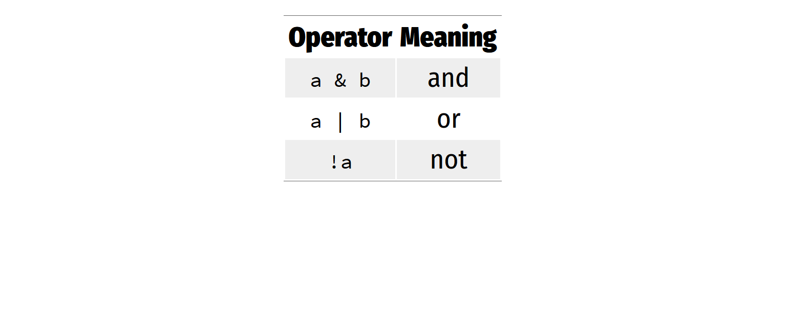
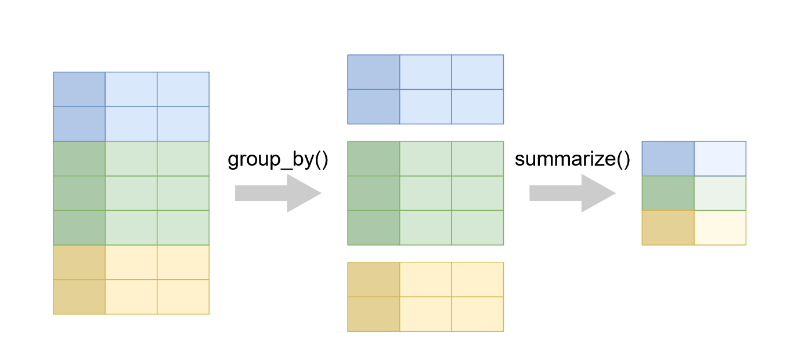
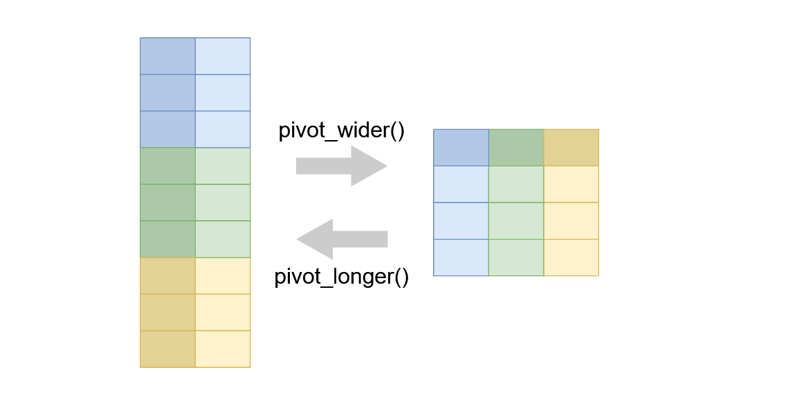

<style type="text/css">
body p {
  color: #000000;
  font-size: 20px;
}
</style>

```{r, include=FALSE}
library(kableExtra)
library(tidyverse)
library(skimr)
library(gapminder)
library(lubridate)
library(rio)
options(knitr.table.format = "latex" )
knitr::opts_chunk$set(fig.align="center" , warning = FALSE, message = FALSE)
```

## Quote 

 **there are many 1M+1 to do something in R , we teach what we think is the best**
     
## Using packages in R

```{r , eval=FALSE ,  class.source="highlight_code"}
install.packages('name')
```

- `r text_spec("Downloads the files to your computer", font_size = 20)`
- `r text_spec("Do this once per computer", background = "#D05A6E", color = "white", bold = T)`

<hr/>

```{r,  eval=FALSE , class.source='highlight_code'}
# How to use the package
library('name')
```

- `r text_spec("Loads the package", font_size = 20)`
- `r text_spec("Do this once per session", background = "#D05A6E", color = "white", bold = T)`

The tidyverse  
===

coherent system of packages for data manipulation


## The tidyverse {.columns-2 .smaller}

### Tidyverse?
- The tidyverse is an opinionated collection of R packages designed for data science.

- All packages share an underlying design philosophy, grammar, and data structures.

- The tidyverse makes data science faster, easier and more fun

<p class="forceBreak"></p>

<div class="image_float">


</div>


### Installing the tidyverse package

```{r, eval=FALSE}
install.packages('tidyverse')
```


## How do we install and load the `rio` package?

```{r}
install.packages('rio')
library(rio)
```


## The tidyverse help

- https://ggplot2.tidyverse.org/

- https://www.tidyverse.org/learn/


## Data frames and tibbles

-	Data frames are the most common kind of data objects; used for rectangular data (like spreadsheets)
-	Data frames: R's native data object
-	Tibbles (tbl): a fancier enhanced kind of data frame

- `r text_spec("(You really won't notice a difference in this class)", background = "#D05A6E", color = "white", bold = T)`


## Before importing data ensure 

1. You have the right project created
2. Have an RScript with the introdcution comments


## Import data with rio
  
```{r, eval=FALSE}
## Data wrangling code
## Author Ken Mwai
## July 2024
library(rio)
library(tidyverse)
liberia <- import('data/liberia_data.csv')
```
 
 
 The tidyverse: dplyr
===


## Dataset to use

 - We use the `linelist` hostpital data
 - It has data on hospital admissions --> *put it in the data folder*
 - Shared via email
 
## Import the data

```{r, eval=TRUE}
## loading the liberia data
liberia <- import('data/liberia_data.csv')
## Load the linelist data
hosp_data <- import("data/line_hospital.xlsx")
```


## Data overview

- Check variable names
- Check the number of variables
- Check the number of rows


```{r, eval=FALSE}
names(hosp_data)  # Check variable names
ncol(hosp_data) # Check the number of variables
nrow(hosp_data) # Check the number of rows
```


## Checking the overall structure

```{r, eval=TRUE}
glimpse(hosp_data)
```


## dplyr: functions for manipulating data

```{r image_pca, echo=FALSE, out.height=  '100%', out.width='70%'}
knitr::include_graphics('images/dplyr2.PNG')
```


dplyr: select
===

Select a subset of variables


```{}
select(.data = DATA, ...)
```

  - `DATA` = Data frame to transform
  - `...` = variables to select


***

### Select specific columns

```{r , echo=FALSE, out.height=  '100%', out.width='70%'}
knitr::include_graphics('images/select.PNG')
``` 


## Our data

```{r, eval=TRUE}
glimpse(hosp_data)
```


## Task

 - Create a data frame `sub1` with case_id, date of onset ,gender and age
 - NB:  remember how to create objects in R
 
```{}
select(.data = DATA, variables , to , select)
```

***

```{r , eval= T}
select(hosp_data,case_id,"date onset",gender, age )
```


dplyr: rename
===

Pick rows: rename()

## rename columns 

```{}
rename(.data = DATA, 
     'new_name' = 'old_name')
```

  - `DATA` = Data frame to transform
  - "new_name"="old_name"

***
 - Why rename?
  - Rename variables names with spaces
  - Shorten very long variable names
  - have a common naming approach
  
```{r , eval= F}
select(hosp_data,case_id,"date onset",gender, age )
```

***
```{r , eval= F}
rename(hosp_data,"date_onset"='date onset' )
rename(hosp_data,"hosp_date"='hosp date' )

```

***

```{r}
hosp_data <- rename(hosp_data,"date_onset"='date onset' )
hosp_data <- rename(hosp_data,"hosp_date"='hosp date' )
glimpse(hosp_data)
```

dplyr: filter
===

Pick rows: filter()


## Extract rows that meet some sort of condition

```{}
filter(.data = DATA, ...)
```

  - `DATA` = Data frame to transform
  - `...` = One or more condition
  - `filter()` returns each row for which the test is TRUE

***

### Filter specific rows

```{r , echo=FALSE, out.height=  '100%', out.width='70%'}
knitr::include_graphics('images/filter.PNG')
``` 

***

```{}
filter(.data = DATA, ...)
```

  - `DATA` = Data frame to transform
  - `...` = One or more condition
  - `filter()` returns each row for which the condition is TRUE


## Filtering only Female data data 


```{r , eval= T}
## use upper case as an example
female <- filter(hosp_data,gender=="f" )

```

- NB: We use `==` which tests if equal (equality test)


*** 

- Create a data of pediatrics 

```{r , eval= F}
## use upper case as an example
paed <- filter(hosp_data,... )
skim(paed)
```


## Filter using logical tests

```{r logical_test, echo=FALSE, out.height=  '100%', out.width='100%'}
knitr::include_graphics('images/logical_test.PNG')
```


## Task : Filter using logical 

:::{.task}
Use filter() and logical tests to create data for female adults
:::


***

```{r , eval= T}
female_adult <- filter(hosp_data,gender=="f" , age>17 )

```


## Common mistakes

- `r text_spec("Using = instead of == ", background = "#FF0000", color = "white", bold = T)`
- `r text_spec("Forgeting quote", background = "#FF0000", color = "white", bold = T)`

```{r , eval=FALSE}

## Wrong
filter(hosp_data,       gender = "f")
filter(hosp_data,       gender = f)


## Correct
filter(hosp_data,       gender == "f")
```

## Boolean operators

```{r boolean, echo=FALSE, out.height=  '100%', out.width='100%'}

```


## These do the same thing:

```{r, eval=FALSE, class.source='highlight_code'}
female_adult <- filter(hosp_data,gender=="f" , age>17 )
```

<hr/>


```{r, eval=FALSE, class.source='highlight_code'}
female_adult <- filter(hosp_data,gender=="f" & age>17 )
```

## Task : Filtering and boolean

:::{.task}

- `r text_spec("Use filter() and Boolean logical tests to show…", background = "#D05A6E", color = "white", bold = T)`

  - Adult females that died

:::

```{r , eval= T}
## explain with died
female_died <- filter(hosp_data,gender=="f" & outcome=="Death" & age>18 )
```

## Filter out rows with missing values

:::{.task}

- `r text_spec("Use filter() and Boolean logical tests to show…", background = "#D05A6E", color = "white", bold = T)`

  - Remove patients with missing gender and outcome
  - In R missing is represented by `NA`
  
:::

```{r, class.source='highlight_code'}
nonmiss <- drop_na(hosp_data, gender, outcome)
```


dplyr: mutate
===

Create new columns: mutate()

***

```{}
mutate(.data = DATA, ...)
```

  - `DATA` = Data frame to transform
  - `...` = Columns to make

***
### Mutate a new column

```{r , echo=FALSE, out.height=  '100%', out.width='70%'}
knitr::include_graphics('images/mutate.PNG')
``` 


***


```{}
mutate(.data = DATA, ...)
```

  - `DATA` = Data frame to transform
  - `...` = Columns to make
  
  
## mutate the age months variable

```{r, class.source='highlight_code'}
hospt_data_clean <- mutate(hosp_data, age_months = age * 12)
```


## mutate the 2 variables

```{r, class.source='highlight_code'}
## age in years
## height in meters
hospt_data_clean <- mutate(hosp_data, age_months = age * 12,
       height_m=ht_cm/100)
```


dplyr: ifelse()
===

Do conditional tests within mutate()


***

```{r , eval=FALSE, class.source='highlight_code'}
ifelse(TEST,
       VALUE_IF_TRUE,
       VALUE_IF_FALSE)
```


 - TEST = A logical test
 - VALUE_IF_TRUE = What happens if test is true
 - VALUE_IF_FALSE = What happens if test is false


## Create a variable to show Adults and Paed

```{r, eval=FALSE}
mutate(hospt_data,
       age_group = ifelse(age > 14, "Adults", "Paed"))
```


## Piping
- You have realized we have run multiple conditions 
- `R pipes` are a way to chain multiple operations together in a concise and expressive way.  
- The `%>%` operator (pipe) takes an object on the left
- Then passes it as the first argument of the function on the right


***

- These two commands do the same thing

```{r, eval=FALSE, , class.source='highlight_code'}
filter(hosp_data, gender == "f")

hosp_data %>% filter(gender == "f")
```

## %>% : Pipe operator

```{r, eval=FALSE}
leave_house(
  take_breakfast(
    get_dressed(
      wake_up(
        me, ## start here
        time = "8:00"), 
      trouser = TRUE, shirt = TRUE , socks=FALSE), 
    mayai = TRUE, viazi = TRUE , chai=TRUE), 
  nduthi = TRUE, car = FALSE)
```


```{r, eval=FALSE, class.source='highlight_code'}
me %>%
  wake_up(time = "8:00") %>%
  get_dressed(trouser = TRUE, shirt = TRUE , socks=FALSE) %>%
  take_breakfast( mayai = TRUE, viazi = TRUE , chai=TRUE, ukwanju=FALSE) %>%
  leave_house( nduthi = TRUE, car = FALSE)
```

***

:::{.task}

 - Put together the mutate, filter,select commands we have ran using the pipe operator
  
:::

tidyr: join data
===

left_join() and right_join()


***
```{r , echo=FALSE, out.height=  '100%', out.width='70%'}

``` 


:::{.task}

 - Join the current file with the hospital location data 
  
:::

## left_join() 

```{r , eval=FALSE}
left_join(
  x = data1,
  y = data2,
  by = "common id",
  ...
)
```


***

 - Import the data to join first

```{r, eval=TRUE}
hospital_location <- import('data/line_hospital_sub.csv')
```

```{r, eval=TRUE}
head(hosp_data)
```

***

```{r}
hosp_left_joined <- left_join(
  x = hosp_data,
  y = hospital_location,
  by = "case_id"
)
head(hosp_left_joined)
```

***

```{r}
hosp_left_joined <- left_join(
  x = hosp_data,
  y = hospital_location,
  by = "case_id"
)
head(hosp_left_joined)
```

## right_join() 

```{r , eval=FALSE}
right_join(
  x = data1,
  y = data2,
  by = "common id",
  ...
)
```

***


```{r}
hosp_right_joined <- right_join(
  x = hosp_data,
  y = hospital_location,
  by = "case_id"
)
head(hosp_right_joined)
```


## inner_join() 

```{r , eval=FALSE}
inner_join(
  x = data1,
  y = data2,
  by = "common id",
  ...
)
```

***


```{r}
hosp_inner_joined <- inner_join(
  x = hosp_data,
  y = hospital_location,
  by = "case_id"
)
head(hosp_inner_joined)
```


***
```{r , echo=FALSE, out.height=  '100%', out.width='70%'}

``` 


***
```{r}
str(hosp_inner_joined)
```


```{r}
str(hosp_left_joined)
```


```{r}
str(hosp_right_joined)
```

## Exporting data from R

 - There are many 1M+1 ...but
 - rio::export function 

```{r , eval=FALSE}
export(data_to_export, file_name_location_extension,)

```


## Exporting the clean version data

```{r}
export(hosp_data, "data/hosp_data_clean.csv")
```


## Working with factors/categorical variables

 - Factors  help in summarizing and plotting data
 - `group_by()`  function is mostly used with factors

## Summarize

```{r , echo=FALSE, out.height=  '100%', out.width='70%'}

``` 

***

:::{.task}

- `r text_spec("Use group_by() and summarize()  to …", background = "#D05A6E", color = "white", bold = T)`

 - Count by gender
 - Count by gender and cough
  
:::


***

```{r}
hosp_data %>% 
 count(gender) 
```

- How can we handle the `NA`


***


```{r}
hosp_data %>% 
  mutate(gender = ifelse(is.na(gender), "unknown",gender))  %>% 
 count(gender) 
```
 
## Gender and Cough factors
 - Here we utilize the group_by function 
 
```{r}
hosp_data %>% 
  mutate(gender = ifelse(is.na(gender), "unknown",gender))  %>% 
  count(gender,cough)
```

## Utilizing the group_by()

- Why use group_by? - You can further operations on the groups

```{r}
hosp_data %>% 
  mutate(gender = ifelse(is.na(gender), "unknown",gender))  %>% 
  group_by(gender) %>% 
  tally()
```

```{r}
hosp_data %>% 
  mutate(gender = ifelse(is.na(gender), "unknown",gender))  %>% 
  group_by(gender,cough) %>% 
  tally()
```

## Working with dates

 - Dates can be a very painful thing to deal with in R especially when they come in different messy formats
 -   `lubridate` is the general package for handling and converting dates  
 
***
```{r}
date_sample <- "2020-10-11"
class(date_sample)
# read date in year-month-day format
ymd(date_sample)
```

***

```{r, eval=TRUE}
mdy("10/11/2020")
dmy("11 10 2020")
```

***

:::{.task}

- `r text_spec("Use ymd()  to …", background = "#D05A6E", color = "white", bold = T)`

 - Convert the  `date_onset` to a date format 
 - Convert the  `hosp_date` to a date format 
  
:::

***

```{r}
class(hosp_data$date_onset)
hosp_data <- hosp_data %>% 
 mutate(date_onset = as_date(date_onset))
class(hosp_data$date_onset)
```


## Extract year and month from dates

:::{.task}

 - Create year of hospital date
 - Create month of hospital date 
  
:::


```{r}
hosp_data <- hosp_data %>% 
 mutate(hosp_year = year(date_onset) ,
        hosp_month = month(date_onset)) 
```

***

```{r}
hosp_data %>%
  group_by(hosp_year) %>% 
  tally()
```


## Some date abbreviations you might come across
 - %d = Day number of month (5, 17, 28, etc.)
 - %j = Day number of the year (Julian day 001-366)
 - %a = Abbreviated weekday (Mon, Tue, Wed, etc.)
 - %A = Full weekday (Monday, Tuesday, etc.) %w = Weekday number (0-6, Sunday is 0)
 - %u = Weekday number (1-7, Monday is 1)
 - %W = Week number (00-53, Monday is week start)
 - %U = Week number (01-53, Sunday is week start)
 - %m = Month number (e.g. 01, 02, 03, 04)
 - %b = Abbreviated month (Jan, Feb, etc.)
 - %B = Full month (January, February, etc.)
 - %y = 2-digit year (e.g. 89)
 - %Y = 4-digit year (e.g. 1989)
 - %h = hours (24-hr clock)
 - %m = minutes
 - %s = seconds %z = offset from GMT
 - %Z = Time zone (character)
 
***
This link has more information: https://epirhandbook.com/new_pages/dates.html

## Working with strings 

```{r}
hosptial_full <- import('data/line_hospitals_locations.xlsx')
hosptial_full %>% 
  group_by(hospital) %>% 
  tally()
```


 - There might be leading white spaces in the data set
 - There are spelling mistakes
 
***

```{r}
hosptial_full <- hosptial_full %>% 
   # re-code hospital column to have same ne
     mutate(hospital = recode(hospital,
                              # for reference: OLD = NEW
                              "Mitilary Hospital"  = "Military Hospital",
                              "Port"               = "Port Hospital",
                              "Port Hopital"       = "Port Hospital",
                              "Mitylira Hopital"   = "Military Hospital",
                              "Mitylira Hospital"  = "Military Hospital",
                              "St. Mark's Maternity Hospital (SMMH)" = "SMMH"))

hosptial_full %>% 
  group_by(hospital) %>% 
  tally()
```


## Removing leading/trailing white space

 - `trimws()` function from `stringr` package
 
```{r}
hosptial_full <- hosptial_full %>% 
   # re-code hospital column to have same ne
  mutate(hospital = trimws(hospital))

hosptial_full %>% 
  group_by(hospital) %>% 
  tally()
```


tidyr: reshape data
===

pivot_longer() and pivot_wider()


## pivot_wider()

- `pivot_wider()` "widens" data, increasing the number of columns and decreasing the number of rows.
- `pivot_wider()` is an updated approach to `spread()`

```{r , eval=FALSE, class.source='highlight_code'}
DATA %>% 
  pivot_wider(names_from,
       values_from ,
       ....)
```

 - DATA  = A data frame to pivot
 - names_from  = Column(s) to pivot into wider format.
 - values_from = Column(s) to to get the cell values from to be into wider format.
 - `...` = other specifications (check help)
 
****
### Pivot wider and longer

```{r , echo=FALSE, out.height=  '100%', out.width='70%'}

``` 

***
## Dataset to use
 - Excerpt of the `Gapminder` data on life expectancy, GDP per capita, and population by country.
 - The data frame `gapminder` has 1704 rows and 6 variables
    - Country -factor with 142 levels
    - Continent -    factor with 5 levels
    - Year - ranges from 1952 to 2007 in increments of 5 years
    - lifeExp - life expectancy at birth, in years
    - Pop - population
    - gdpPercap - GDP per capita (US$, inflation-adjusted)

 - `r text_spec("Task: Install and load the gapminder package", background = "#D05A6E", color = "white", bold = T)`
 
 

***

- Filter data after 1992
- Select the `continent, country, year and gdpPercap` and pivot_wider the values of `gdpPercap` by `country`
 

```{r, class.source='highlight_code'}
gapminder_sub <- gapminder %>% 
  select(continent, country, year, gdpPercap) %>% 
  filter(year>1992 )
gapminder_sub %>%
 pivot_wider(names_from =country , values_from =gdpPercap )
```


***
 - What if I remove the continent?


```{r, class.source='highlight_code'}
country_gdp_wider <- gapminder_sub %>%
  select(-continent) %>% 
 pivot_wider(names_from =country , values_from =gdpPercap )
country_gdp_wider
```


## pivot_longer()

- `pivot_longer()` "lengthens" data, increasing the number of rows and decreasing the number of columns.
- `pivot_longer()` is an updated approach to `gather()`

```{r , eval=FALSE, class.source='highlight_code'}
DATA %>% 
  pivot_longer(cols,
               names_to = ,
               values_to = ,
       ....)
```

 - DATA  = A data frame to pivot
 - cols  = Columns to pivot into longer format.
 - names_to = name of the column to create from the data stored in the column names
 - values_to = string specifying the name of the column to create from the data stored in cell values
 - `...` = other specifications (check help)

***

- We use the `country_gdp` pivot_longer the values of `gdpPercap`

```{r, class.source='highlight_code'}
country_gdp_longer <- country_gdp_wider %>%
 pivot_longer(cols =!year, names_to="country",values_to = "gdpPercap")  
country_gdp_longer
```

 
****

### How to export  data to CSV

```{r , eval=FALSE, class.source='highlight_code'}
export(x = median_gdpPercap_longer, file = "data/median_gdpPercap_longer.csv")
```


### How to export  data to Stata

```{r , eval=FALSE, class.source='highlight_code'}
export(x = median_gdpPercap_longer, file = "data/median_gdpPercap_longer.dta")
```

