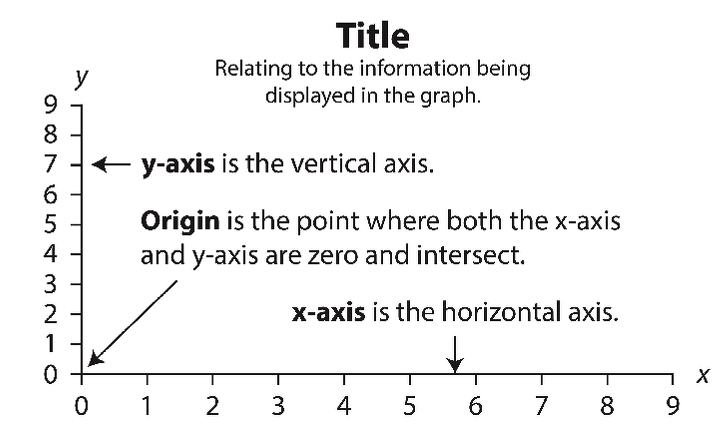

<style type="text/css">
body p {
  color: #000000;
  font-size: 40px;
}
</style>


```{r, include=FALSE}
library(kableExtra)
library(tidyverse)
library(skimr)
library(gapminder)
library(lubridate)
library(rio)
library(knitr)
library(tidyr)
library(jhur)

options(knitr.table.format = "latex" )
knitr::opts_chunk$set(fig.align="center" , warning = FALSE, message = FALSE)
```

## Session objective

- <font size="6">To create basic graphs using R.</font>

## Fundamentals data visualization

- <font size="6">Graphs must be labelled properly.</font>

- <font size="6">Graphs should be as intuitive as possible and not misleading.</font>


## Anatomy of a graph

```{r, fig.alt="plot_anatomy", out.width = "70%", echo = FALSE,fig.align='center'}

```

 
## Plots types

<font size="5">For one numerical variable:</font>

-   <font size="5">**Density plots**</font>
-   <font size="5">**Histogram**</font>
-   <font size="5">**Box plots**</font>

<font size="5">For two numerical variables:</font>

-   <font size="5">**Scatter plots**</font>
-   <font size="5">**Line graph**</font>

<font size="5">For categorical variables:</font>

-   <font size="5">**Bar plots**</font>
-   <font size="5">**Pie charts - NEVER USE THEM!!!**</font>


## Plots for numerical data

<font size="5">**Density plot**: shows the distribution of a numerical variable</font>

```{r, fig.alt="density", out.width = "60%", echo = FALSE,fig.align='center'}
knitr::include_graphics("https://r-graph-gallery.com/21-distribution-plot-using-ggplot2_files/figure-html/unnamed-chunk-1-1.png")
```

## Plots for numerical data

<font size="5">**Histogram**: shows the distribution of a numerical variable</font>

```{r, fig.alt="histogram", out.width = "60%", echo = FALSE,fig.align='center'}
knitr::include_graphics("https://r-graph-gallery.com/220-basic-ggplot2-histogram_files/figure-html/unnamed-chunk-4-2.png")
```

## Plots for numerical data

<font size="5">**Box plot**: shows the distribution of a numerical variable.</font>

```{r, fig.alt="boxplot", out.width = "80%", echo = FALSE,fig.align='center'}
knitr::include_graphics("https://r-graph-gallery.com/img/other/boxplot_explanation.png")
```

## Plots for numerical data

<font size="5">**Box plot**: mostly used to compare distribution between groups.</font>

```{r, fig.alt="boxplot_compare", out.width = "60%", echo = FALSE,fig.align='center'}
knitr::include_graphics("https://r-graph-gallery.com/89-box-and-scatter-plot-with-ggplot2_files/figure-html/unnamed-chunk-3-1.png")
```


## Plots for categorical data

<font size="5">**Bar plot**: useful for summarising frequencies of categories.</font>

```{r, fig.alt="barplot", out.width = "40%", echo = FALSE,fig.align='center'}
knitr::include_graphics("https://r-graph-gallery.com/208-basic-barplot_files/figure-html/thecode-1.png")
```


## R graphical frameworks

 <font size="6">1. base R</font>

 <font size="6">2. grid</font>

 <font size="6">3. lattice</font>

 <font size="6">4. ggplot2 - our focus this week!</font>

 <font size="6">5. plotly</font>


## ggplot framework

-   <font size="5">A package for producing graphics - gg = *Grammar of Graphics*</font>

-   <font size="5">Created by Hadley Wickham in 2005</font>

-   <font size="5">Belongs to "Tidyverse" family of packages</font>

-   <font size="5">*"Make a ggplot"* = Make a plot with the use of ggplot2 package</font>

Resources:

-   <https://ggplot2-book.org/>

-   <https://www.opencasestudies.org/>

-   <https://ggplot2.tidyverse.org/articles/ggplot2.html>

## Why learn ggplot2?

<font size="5">Extremely powerful/flexible</font>

<font size="5">Very customizable:</font>

-   <font size="5">branding</font>
-   <font size="5">making plots interactive</font>
-   <font size="5">combining plots</font>

<font size="5">Easier plot automation (creating plots in scripts)</font>

<font size="5">Faster (eventually)</font>


## ggplot2 

<font size="5">ggplot2 is designed to work iteratively:</font>

- <font size="5">You start with a layer that draws the axes</font>

- <font size="5">Add a layer that shows the raw data</font>

- <font size="5">Add layers of annotations and statistical summaries</font>


<font size="5">Layers are are placed on top of each other using **`+`**</font>

## Every ggplot2 plot has three key components 

<font size="5">**data**, i.e., the data that should be visualized.</font>

<font size="5">**aesthetics**, i.e., which variable should be mapped to which axis using **`aes()`**.</font>

<font size="5">**geometrics**, i.e., the type of graph that should be created, e.g., scatter plot or boxplot.</font>

<font size="5">However, you **can** specify for more details, for instance:</font>

- <font size="5">**scale** used in the X and Y axes</font>
- <font size="5">**themes** - e.g., change background color</font>
- <font size="5">**facets** - i.e., specify subplots</font>


# First plot with `ggplot2` package

## First order of business!


- <font size="5">Install the *ggplot2* package</font>

   - <font size="5">install.packages("ggplot2")</font>

- <font size="5">load all libraries that were used on Day 2 using `library()`</font>

- <font size="5">load the *ggplot2* package</font>


## First layer of code with `ggplot2` package

<font size="5">**Aesthetic mapping** `aes(x= , y =)` describes how variables in our data are mapped to elements of the plot - Note you don't need to use `mapping` but it is helpful to know what we are doing.</font>

::: codeexample
```{r, eval = FALSE, class.source = "codeexample"}
library(ggplot2) # don't forget to load ggplot2
# This is not code but shows the general format
ggplot({data_to_plot}, aes(x = {var in data to plot},
                                      y = {var in data to plot}))
```
:::

```{r, fig.width=3, fig.height=2.5, fig.align='center', class.source = "codereg"}
ggplot(Orange, aes(x = circumference, y = age))
```

## Next layer code with `ggplot2` package

<font size="5">There are many to choose from, to list just a few:</font>

-   <font size="5">`geom_point()` -- points</font>
-   <font size="5">`geom_line()` -- lines to connect observations</font>
-   <font size="5">`geom_boxplot()` -- boxplots</font>
-   <font size="5">`geom_histogram()` -- histogram</font>
-   <font size="5">`geom_bar()` -- bar plot</font>
-   <font size="5">`geom_tile()` -- blocks filled with color</font>

## Next layer code with `ggplot2` package

<font size="5">When to use what plot? A few examples:</font>

- <font size="5">**scatterplot (`geom_point()`)**: to examine the relationship between two sets of continuous numeric data</font>

- <font size="5">**barplot (`geom_bar()`)**: to compare the distribution of a quantitative variable (numeric) between groups or categories</font>

- <font size="5">**histogram (`geom_hist()`)**: to observe the overall distribution of numeric data</font>

- <font size="5">**boxplot (`geom_boxplot()`)**: to compare values between different factor levels or categories</font>

## Next layer code with `ggplot2` package

<font size="5">Need the `+` sign to add the next layer to specify the type of plot</font>

::: codeexample
```{r, eval = FALSE, class.source = "codeexample"}

ggplot({data_to plot}, aes(x = {var in data to plot},
                                      y = {var in data to plot})) +
  geom_{type of plot}</div>
```
:::

```{r, fig.width=4, fig.height=3, fig.align='center'}
ggplot(Orange, aes(x = circumference, y = age)) +
  geom_point()
```


## Tip - plus sign `+` must come at end of line

<font size="5">Having the + sign at the beginning of a line will not work!</font>

```{r, eval = FALSE}
ggplot(Orange, aes(x = circumference, y = age))
 + geom_point()
```


<font size="5">Pipes will also not work in place of `+`!</font>

```{r,eval = FALSE}
ggplot(Orange, aes(x = circumference, y = age)) %>% 
   geom_point()
```


## Plots can be assigned as an object {.mall}

```{r, fig.width=4, fig.height=3, fig.align='center'}
plt1 <- ggplot(Orange, aes(x = circumference, y = age)) +
          geom_point()

plt1
```


## Examples of different geoms

```{r, fig.show="hold", out.width="30%"}
plt1 <- ggplot(Orange, aes(x = circumference, y = age)) +
          geom_point()

plt2 <- ggplot(Orange, aes(x = circumference, y = age)) +
          geom_line()

plt1 # fig.show = "hold" makes plots appear
plt2 # next to one another in the chunk settings
```


## Specifying plot layers: combining multiple layers

<font size="5">Layer a plot on top of another plot with `+`</font>

```{r, fig.width=4, fig.height=3, fig.align='center'}
ggplot(Orange, aes(x = circumference, y = age)) +
  geom_point() +
  geom_line()
```


## Adding color

<font size="5">You can map color to a variable</font>

```{r, fig.width=4, fig.height=3, fig.align='center'}
ggplot(Orange, aes(x = circumference, y = age, color = Tree)) +
  geom_point() +
  geom_line()
```

## Adding color or change the color of each plot layer

<font size="5">
You can change look of each layer separately. Note the arguments like `linetype` and `alpha` that allow us to change the opacity of the points and style of the line respectively. 
</font>

```{r, fig.width=5, fig.height=3, fig.align='center'}
ggplot(Orange, aes(x = circumference, y = age)) +
  geom_point(size = 5, color = "red", alpha = 0.5) +
  geom_line(size = 0.8, color = "black", linetype = 2)
```

<font size="5">
`linetype` can be given as a number. See the docs for what numbers correspond to what `linetype`!
</font>


# Customize the look of the plot


## Customize the look of the plot {.codesmall}

You can change the look of whole plot using [`theme_*()` functions](https://ggplot2.tidyverse.org/reference/ggtheme.html).

```{r, fig.width=5, fig.height=3, fig.align='center'}
ggplot(Orange, aes(x = circumference, y = age)) +
  geom_point(size = 5, color = "red", alpha = 0.5) +
  geom_line(size = 0.8, color = "brown", linetype = 2) +
  theme_dark()
```

## More themes!

There's not only the built in ggplot2 themes but all kinds of themes from other packages! 
- [ggthemes](https://jrnold.github.io/ggthemes/)
- [ThemePark package](https://github.com/MatthewBJane/ThemePark)
- [hrbr themes](https://github.com/hrbrmstr/hrbrthemes)

## Customize the look of the plot

You can change the look of whole plot - **specific elements, too** - like changing [font](http://www.cookbook-r.com/Graphs/Fonts/) and font size - or even more [fonts](https://blog.revolutionanalytics.com/2012/09/how-to-use-your-favorite-fonts-in-r-charts.html)

```{r, fig.width=6, fig.height=3.5, fig.align='center'}
ggplot(Orange, aes(x = circumference, y = age)) +
  geom_point(size = 5, color = "red", alpha = 0.5) +
  geom_line(size = 0.8, color = "brown", linetype = 2) +
  theme_bw() +
  theme(text=element_text(size=16,  family="Comic Sans MS"))
```

## Adding labels {.codesmall}

The `labs()` function can help you add or modify titles on your plot. The `title` argument specifies the title. The `x` argument specifies the x axis label. The `y` argument specifies the y axis label.

```{r, fig.width=4, fig.height=2.5, fig.align='center'}
ggplot(Orange, aes(x = circumference, y = age)) +
            geom_point(size = 5, color = "red", alpha = 0.5) +
            geom_line(size = 0.8, color = "brown", linetype = 2) +
            labs(title = "My plot of orange tree data",
              x = "Tree Circumference (mm)",
              y = "Tree Age (days since 12/31/1968)")
```

## Adding labels line break {.codesmall}

Line breaks can be specified using `\n` within the `labs()` function to have a label with multiple lines.

```{r, fig.width=4, fig.height=2.5, fig.align='center'}
ggplot(Orange, aes(x = circumference, y = age)) +
            geom_point(size = 5, color = "red", alpha = 0.5) +
            geom_line(size = 0.8, color = "brown", linetype = 2) +
            labs(title = "Plot of orange tree data from 1968: \n trunk circumference vs tree age",
              x = "Tree Circumference (mm)",
              y = "Tree Age (days since 12/31/1968)")
```

## Changing axis: specifying axis scale {.codesmall}

`scale_x_continuous()` and `scale_y_continuous()` can change how the axis is plotted. Can use the `breaks` argument to specify how you want the axis ticks to be.

```{r, fig.width=5, fig.height=3, fig.align='center'}
range(pull(Orange, circumference))
range(pull(Orange, age))
plot_scale <-ggplot(Orange, aes(x = circumference, y = age)) +
                geom_point(size = 5, color = "red", alpha = 0.5) +
                geom_line(size = 0.8, color = "brown", linetype = 2) +
                scale_x_continuous(breaks = seq(from = 20, to = 240, by = 20)) +
                scale_y_continuous(breaks = seq(from = 100, to = 1600, by = 200))
```

## Changing axis: specifying axis limits

`xlim()` and `ylim()` can specify the limits for each axis

```{r, fig.width=5, fig.height=3, fig.align='center'}

ggplot(Orange, aes(x = circumference, y = age)) +
  geom_point(size = 5, color = "red", alpha = 0.5) +
  geom_line(size = 0.8, color = "brown", linetype = 2) +
  labs(title = "My plot of orange tree circumference vs age") +
  xlim(100, max(pull(Orange, circumference)))

```

## Changing axis: specifying axis scale {.codesmall}

```{r, fig.width=5, fig.height=1.8, fig.align='center'}
plot_scale
```

```{r, fig.width=5, fig.height=1.8, fig.align='center', echo = TRUE}
ggplot(Orange, aes(x = circumference, y = age)) +
                geom_point(size = 5, color = "red", alpha = 0.5) +
                geom_line(size = 0.8, color = "brown", linetype = 2)
```

## Changing axis: specifying axis limits

`xlim()` and `ylim()` can specify the limits for each axis

```{r, fig.width=5, fig.height=3, fig.align='center'}

ggplot(Orange, mapping = aes(x = circumference, y = age)) +
  geom_point(size = 5, color = "red", alpha = 0.5) +
  geom_line(size = 0.8, color = "brown", linetype = 2) +
  labs(title = "My plot of orange tree circumference vs age") +
  xlim(100, max(pull(Orange, circumference)))

```

## Modifying plot objects

You can add to a plot object to make changes! Note that we can save our plots as an object like `plt1` below. And now if we reference `plt1` again our plot will print out!

```{r, fig.width=5, fig.height=3, fig.align='center'}

plt1 <- ggplot(Orange, aes(x = circumference, y = age)) +
  geom_point(size = 5, color = "red", alpha = 0.5) +
  geom_line(size = 0.8, color = "brown", linetype = 2) +
  labs(title = "My plot of orange tree circumference vs age") +
  xlim(100, max(pull(Orange, circumference)))

plt1 + theme_minimal()
```

## Overwriting specifications

It's possible to go in and change specifications with newer layers

```{r, fig.width=5, fig.height=3, fig.align='center'}
Orange %>% ggplot(aes(x = circumference,
                      y = age,
                      color = Tree)) +
  geom_line(size = 0.8)
```

## Removing the legend label

You can use `theme(legend.position = "none")` to remove the legend. 

```{r, fig.width=5, fig.height=3, fig.align='center'}

Orange %>% ggplot(aes(x = circumference,
                      y = age,
                      color = Tree)) +
  geom_line(size = 0.8) + 
  theme(legend.position = "none")
```

## Overwriting specifications

It's possible to go in and change specifications with newer layers

```{r, fig.width=5, fig.height=3, fig.align='center'}
Orange %>% ggplot(aes(x = circumference,
                      y = age,
                      color = Tree)) +
  geom_line(size = 0.8, color = "black")
```


## Summary

-   `ggplot()` specifies what data use and what variables will be mapped to where
-   inside `ggplot()`, `aes(x = , y = , color =)` specify what variables correspond to what aspects of the plot in general
-   layers of plots can be combined using the `+` at the **end** of lines
-   special [`theme_*()` functions](https://ggplot2.tidyverse.org/reference/ggtheme.html) can change the overall look
-   individual layers can be customized using arguments like: `size`, `color` `alpha` (more transparent is closer to 0), and `linetype`
-   labels can be added with the `labs()` function and `x`, `y`, `title` arguments - the `\n` can be used for line breaks
-   `xlim()` and `ylim()` can limit or expand the plot area
-   `scale_x_continuous()` and `scale_y_continuous()` can modify the scale of the axes
-   by default, `ggplot()` removes points with missing values from plots.


## theme() function:

The `theme()` function can help you modify various elements of your plot. Here we will adjust the font size of the plot title.

```{r, fig.width=5, fig.height=3, fig.align='center'}
ggplot(Orange, aes(x = circumference, y = age)) +
  geom_point(size = 5, color = "red", alpha = 0.5) +
  geom_line(size = 0.8, color = "brown", linetype = 2) +
  labs(title = "Circumference vs age") +
  theme(plot.title = element_text(size = 20))

```

## theme() function

The `theme()` function always takes:

1.  an object to change (use `?theme()` to see - `plot.title`, `axis.title`, `axis.ticks` etc.)
2.  the aspect you are changing about this: `element_text()`, `element_line()`, `element_rect()`, `element_blank()`
3.  what you are changing:
    -   text: `size`, `color`, `fill`, `face`, `alpha`, `angle`
    -   position: `"top"`, `"bottom"`, `"right"`, `"left"`, `"none"`
    -   rectangle: `size`, `color`, `fill`, `linetype`
    -   line: `size`, `color`, `linetype`

## theme() function: center title and change size

The `theme()` function can help you modify various elements of your plot. Here we will adjust the horizontal justification (`hjust`) of the plot title.

```{r, fig.width=5, fig.height=3, fig.align='center'}
ggplot(Orange, aes(x = circumference, y = age)) +
  geom_point(size = 5, color = "red", alpha = 0.5) +
  geom_line(size = 0.8, color = "brown", linetype = 2) +
  labs(title = "Circumference vs age") +
  theme(plot.title = element_text(hjust = 0.5, size = 20))

```

## theme() function: change title and axis format

```{r, fig.width=5, fig.height=3, fig.align='center'}
ggplot(Orange, aes(x = circumference, y = age)) +
  geom_point(size = 5, color = "red", alpha = 0.5) +
  geom_line(size = 0.8, color = "brown", linetype = 2) +
  labs(title = "Circumference vs age") +
  theme(plot.title = element_text(hjust = 0.5, size = 20),
        axis.title = element_text(size = 16))
```

## theme() function: moving (or removing) legend {.codesmall}

If specifying position - use: "top", "bottom", "right", "left", "none"

```{r, fig.show="hold", out.width="40%"}
ggplot(Orange, aes(x = circumference, y = age, color = Tree)) +
  geom_line()

ggplot(Orange, aes(x = circumference, y = age, color = Tree)) +
  geom_line() +
  theme(legend.position = "none")
```

## Cheatsheet about theme

<https://github.com/claragranell/ggplot2/blob/main/ggplot_theme_system_cheatsheet.pdf>


## Keys for specifications

`linetype`

[source](http://www.cookbook-r.com/Graphs/Shapes_and_line_types/figure/line_types-1.png)

## Linetype key

-   *geoms* that draw lines have a `linetype` parameter
-   these include values that are strings like "blank", "solid", "dashed", "dotdash", "longdash", and "twodash"

```{r, fig.width=5, fig.height=3, fig.align='center'}
Orange %>% ggplot(aes(x = circumference,
                      y = age,
                      color = Tree)) +
  geom_line(size = 0.8, linetype = "twodash")
```


