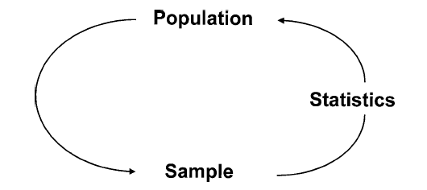

<style type="text/css">
body p {
  color: #000000;
  font-size: 20px;
}
</style>

```{r, include=FALSE}
library(kableExtra)
library(tidyverse)
library(skimr)
library(gapminder)
library(lubridate)
library(rio)
library(flextable)
library(gtsummary)
options(knitr.table.format = "latex" )
knitr::opts_chunk$set(fig.align="center" ,eval=FALSE, warning = FALSE, message = FALSE)
```

```{r , echo=FALSE,eval=TRUE}

#############################################
# Data wrangling
# Script for cleaning the line list data
#############################################


# Load packages -----------------------------------------------------------
library(rio)
library(epikit)
library(janitor)
library(lubridate)
library(tidyverse)

hospital_df <- import("../data/line_hospital_data.csv")
location_df <- import("../data/line_hospitals_locations.xlsx")

# Question 1.2CCreate a pipe chain to clean the hospital_df-----------------------------------------------------
hospital_df_clean <- hospital_df %>% 
  filter(case_id!="") %>% 
  ## this function from janitor helps remove spaces and non standard names
  clean_names() %>%  
  ##remove duplicates to avoid warnings during merge
  distinct(case_id , .keep_all = T) %>% 
  ## creating BMI
  mutate(ht_m = ht_cm/100 ,
         BMI = wt_kg/(ht_m^2)) %>% 
  # create age category column
  mutate(age_cat = age_categories(        
    age,                             
    lower = 0,
    upper = 70,
    by = 10)) %>% 
  ##convert dates
  mutate(date_of_outcome=dmy(date_of_outcome),
         hosp_date=dmy(hosp_date),
         date_onset=as_date(date_onset)
         ) %>% 
  #creat year and month
  mutate(year_hosp=year(hosp_date),
         month_hosp=month(hosp_date),
         
         year_onset=year(date_onset),
         #Create a `year_onset` and `month_onset` from date onset date data
         month_onset=month(date_onset) ,
         #Create a new variable `days_to_hosp`by subtracting `hosp_date` - `date_onset`
         days_to_hosp=hosp_date - date_onset)


# 1.3 Merge the datasets --------------------------------------------------

hospital_df_merged <- hospital_df_clean %>% 
  left_join(location_df , by = 'case_id') 


## clean hospital
hospital_df_merged <- hospital_df_merged %>% 
  # re-code hospital column to have same ne
  mutate(hospital = recode(hospital,
                           # for reference: OLD = NEW
                           "Mitilary Hospital"  = "Military Hospital",
                           "Port"               = "Port Hospital",
                           "Port Hopital"       = "Port Hospital",
                           'Military Hopital' = "Military Hospital",
                           "Mitylira Hopital"   = "Military Hospital",
                           "Mitylira Hospital"  = "Military Hospital",
                           'Central Hopital'   = 'Central Hospital',
                           'St. Marks Maternity Hopital (SMMH)' = "SMMH",
                           "St. Mark's Maternity Hospital (SMMH)" = "SMMH"))

```


## Data exploration
 - Except when a full census is taken, we collect data on a sample a population.
 - Data we collect can either be categorical or continous
 - Then you can derive new variables using `mutate`
 
```{r sample, echo=FALSE, out.height=  '100%', out.width='70%'}

```


## How can you summarize data?
 - _Summary statistics_ , also known as _descriptive statistics_, is the first step in the analysis of data.
 - For a continuous variable you can summarize by 
   - _Measures of central tendency_ : Mean,Median ,Mode
   - _Measures of dispersion_: variance, SD, mad, min,max , IQR
 - We mostly report an  _Measures of central tendency_  with its associated _Measures of dispersion_
 - For categorical variables you can do a count or frequency 
   - proportions or percentages of the total number of individuals

   


## Summary statistics for continuous {mean,sd}

 - The _mean_ or the _average_ is the sum total of all the data point values of a numerical variable divided by the total number of data point values.
 
 - In R we use the function `mean()` is used to calculate the mean
 

 $$ \bar{x} = \frac{1}{n} \sum_{i=1}^{n} x_i\tag{1}$$
```{r Calculating the mean}
x <- c(10, 11, 12,13,14,15)
mean(x)  

y <- c(10, 11, 12,13,14,15 ,NA)
mean(y)
```

***

 - With missing values you have to exclude them in the calculation

```{r mean2 , eval=TRUE}
y <- c(10, 11, 12,13,14,15 ,NA)
## with missing it returns an error
mean(y)

## exclude missing values her
mean(y , na.rm=T)
```


***
 - __variance__ is the average difference between each value and the __mean__.
 - The __standard deviation__ is the square root of the __variance__
 - The SD is what is mostly reported

 
$$\sigma = \sqrt{\frac{\sum_{i=1}^{n} {\left( x_i - \bar{x} \right)}^{2}}{n-1}} \tag{2}$$

  - Why sd and not variance?
  - In R we use the function `sd()` is used to calculate the mean
 
 ***
 
```{r sd}
x <- c(10, 11, 12,13,14,15)
sd(x)  
y <- c(10, 11, 12,13,14,15 ,NA)
sd(y , na.rm=T)
```


## Summary statistics for continuous {median,min,max,mad}

- The _max__ and the __min__ are the minimum and maximum values of a given variable respectively

- In R we use the function `mix()` and `max()` to find the minimum and maximum value.

```{r min_max}
x <- c(10, 11, 12,13,14,15)
min(x)  
max(x)
y <- c(10, 11, 12,13,14,15 ,NA)
min(y , na.rm=T)
max(y, na.rm=T )
```

***

- The __median__ is the midway value; half of the distribution lies below the __median__ and half above it

$$ \bar{x} = \frac{n+1}{2}th \quad value \quad of \quad ordered \quad values \tag{3}$$

- The median is great for values that are not symmetric around the mean. For normally distributed values the median will be equal to mean. 

- NB: A histogram can help in checking the distribution

- In R we use the function `median()` is used to calculate the median

*** 

```{r median1}
x <- c(10, 11, 12,13,14,15)
median(x)  
y <- c(10, 11, 12,13,14,15 ,NA)
median(y , na.rm=T)
```

- However for the below vector a `mean` would be a misrepresentation so we would report median

```{r median3}
z <- c(10, 11, 12,13,14,15,NA,100,200)
mean(z , na.rm=T)
median(z, na.rm=T)  
```


*** 

- __SD__ rely on the mean value to compute the average distance of scores away from the center 
  - The squared differences are used, thus SD is sensitive to outliers
- __MAD__ is a resistant measure of variability 
   - Relies on the median as the estimate of the center of the distribution
   - Relies on the absolute difference rather than the squared difference
-  __MAD__ is the median of the absolute deviations from the median

$$\text{MAD} = \text{median}(|X_i - \text{median}(X)|)$$


- In R we use the function `mad()` is used to calculate the mad


***


```{r median2}
z <- c(10, 11, 12,13,14,15,NA,100,200)
mad(z , na.rm=T)
```


## Vectors are not giving lets use a dataframe!!

 - For the examples here I will use the cleaned data set
 - Lets I want to calculate a measure of central tendency  
    1. Check the distribution then decide
    2. Check if there is any missing values
    3. Calculate the measure

## Mean of age

```{r}
hospital_df_merged %>% 
  summarise(mean = mean(age, na.rm = T))
```

## Mean and SD of age

```{r}
hospital_df_merged %>% 
  summarise(mean = mean(age, na.rm = T) ,
            sd = sd(age,na.rm=T))
```


## Median, mad, min and max 

```{r}
hospital_df_merged %>% 
  summarise(n=n(),
            median = median(age, na.rm = T) ,
            mad = mad(age,na.rm=T) ,
            min = min(age, na.rm=T) ,
            max =  max(age, na.rm=T) )
```
***

```{r}
hospital_df_merged %>% 
  summarise(n=n(),
            median = median(age, na.rm = T) ,
            mad = mad(age,na.rm=T) ,
            min = min(age, na.rm=T) ,
            max =  max(age, na.rm=T) ,
            ## what is IQR
            #difference between the third and the first quartile values.
            IQR = IQR(age, na.rm=T))
```

## Summary statistics by groups

```{r}
hospital_df_merged %>% 
  group_by(gender) %>% 
  summarise(n=n(),
            median = median(age, na.rm = T) ,
            mad = mad(age,na.rm=T) ,
            min = min(age, na.rm=T) ,
            max =  max(age, na.rm=T),
            mean = mean(age, na.rm=T) ,
            sd = sd(age,na.rm=T))
```


## Summary stats using the `rstatix` package

- A friendly approach and it is `tidyverse` and `piping` friendly 


```{r , eval=T}
hospital_df_merged %>%
  rstatix::get_summary_stats(age, wt_kg)
```


***

```{r , eval=T}
hospital_df_merged %>%
  rstatix::get_summary_stats(age, wt_kg , type = "common")
```


***


```{r , eval=T , echo=FALSE}
hospital_df_merged %>%
  filter(gender!="") %>% 
  group_by(gender) %>% 
  rstatix::get_summary_stats(age, wt_kg , type = "common") %>% 
  flextable::flextable() %>% 
  theme_apa()
```


## Summary of categorical variables

 - For categorical variables you can do a count or frequency 
   - proportions or percentages of the total number of individuals
 - The `n()` , `count` , `tally()` functions are utilized to count for categorical variables
 
 
```{r, eval=T}
hospital_df_merged %>% 
  count(gender)
```

***

```{r ,eval=T}
hospital_df_merged %>% 
  group_by(gender) %>% 
  tally()
```

***

```{r ,eval=T}
hospital_df_merged %>% 
  group_by(gender) %>% 
  summarise(n=n() ) 
```

***

```{r ,eval=T}
hospital_df_merged %>% 
  group_by(gender) %>% 
  summarise(n=n()) %>% 
   mutate(freq = n / sum(n),
          percent= freq*100)
```


***

```{r,eval=T}
hospital_df_merged %>% 
  group_by(gender) %>% 
  tabyl(cough) 
```

```{r,eval=T}
hospital_df_merged %>% 
  group_by(gender) %>% 
  tabyl(cough) %>% 
  adorn_pct_formatting()
```

## Apply reshape in summary

```{r,eval=T}
tbl1 <- hospital_df_merged %>% 
  group_by(gender,cough) %>% 
summarise(n=n() , mean_age=mean(age,na.rm=T))
tbl1
```

***

```{r,eval=T}
tbl1 %>% 
pivot_wider(names_from = gender, 
            values_from = n:mean_age)
```

## gtsummary package

```{r,eval=T}
##gtsummary  package
hospital_df_merged %>% 
  select(gender, outcome) %>%    # keep variables of interest
  tbl_summary(by = outcome) 
```


## Comparison of means 

 - In a study of the determinants of weight, we may wish to compare the mean weight of individuals that had a cough and those that did not.
 - Compares only 2 ggroups
 
 - In general we compare the mean of $\bar{x_coughed}$ and $\bar{x_{!coughed}}$ 
 
 - `Ttest` is used to compare means: **However** take note of these assumptions
       - Independence of observations
       - Normality of observations
       - Homogeneity of variances
       
***
```{r ,eval=T}
hospital_df_merged <- hospital_df_merged %>% 
    filter(case_id!="") %>% 
  filter(gender!="")
t.test(data=hospital_df_merged ,
       wt_kg ~ gender)
```
       

  
***
A clean output

```{r}
t_test_tab <- t.test(data=hospital_df_merged ,
       wt_kg ~ gender)

broom::tidy(t_test_tab)
```

***

```{r , eval=TRUE}
df_test <- hospital_df_merged %>% filter(cough!="")
t.test(data=df_test ,
       wt_kg ~ cough)
```

***

## gtsummary package

```{r ,eval=T}
hospital_df_merged %>% 
  filter(cough!="") %>%   ## remove missing cough
  select(wt_kg, cough) %>%             # keep variables of interest
  tbl_summary(                               # produce summary table
    statistic = wt_kg ~ "{mean} ({sd})", # specify what statistics to show
    by = cough) %>%                        # specify the grouping variable
  add_p(wt_kg ~ "t.test")                # specify what tests to perform
```


## Comparison of proportions 


## Comparison of proportions 

